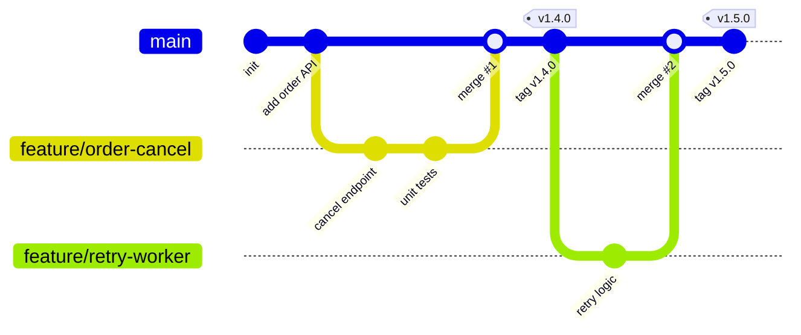
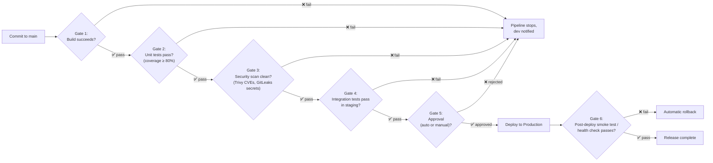
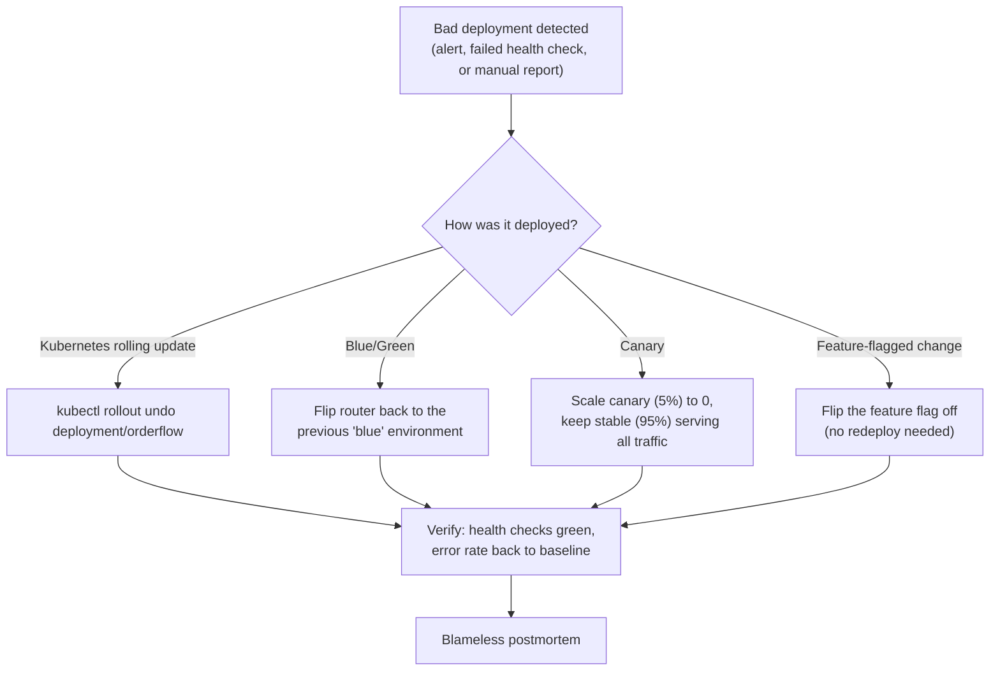
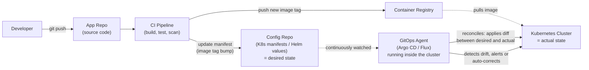

# CI/CD Workflow: Branching, Quality Gates & Rollback

---

## 1. Branching Strategy — Trunk-Based Development

Most elite-performing teams use **trunk-based development**: short-lived feature branches (hours to a couple of days) that merge into `main` frequently, rather than long-lived branches that diverge for weeks. Long-lived branches are the enemy of "Lean" thinking — the longer a branch lives, the bigger and riskier the eventual merge.

Example: A developer branches `feature/order-cancel` off `main` in the morning, opens a pull request by afternoon, and it's merged the same day once tests and review pass. Compare that to a `release/2.0` branch that lives for six weeks and diverges so far from `main` that merging it back causes 40 conflicting files — that's the pattern trunk-based development avoids.

Two common variants layered on top of trunk-based development:
- **Feature flags** instead of feature branches for long-running work — merge incomplete code to `main` behind a flag that's off by default, so `main` always stays deployable.
- **Release branches** (`release/1.5`) only for scheduled, versioned software (e.g., mobile apps going through app-store review) — not needed for continuously deployed services.

---

## 2. Quality Gates — the Checkpoints Before Production

A **quality gate** is an automated checkpoint the pipeline must pass before code advances to the next stage. Each gate should fail fast and cheap — catch a bug in unit tests (seconds) rather than in production (hours of MTTR).

Example, mapped to a real pipeline (e.g., a Jenkinsfile for a service like OrderFlow-Lite):

| Gate | What it checks | Example tool | If it fails |
|---|---|---|---|
| Build | Code compiles / installs cleanly | `npm ci && npm run build` | Pipeline stops, no further stages run |
| Unit tests | Logic is correct in isolation | Jest / Supertest | Pipeline stops; PR shows red X |
| Security scan | No known CVEs, no leaked secrets | Trivy (image CVEs), GitLeaks (secrets) | Pipeline stops; a hardcoded secret or a CVE-pinned dependency blocks merge |
| Integration tests | Service behaves correctly with its real dependencies (e.g., MySQL) | Test suite against a staging DB | Pipeline stops before touching production |
| Approval | Human sign-off (for risky changes) or auto-approval (for low-risk, well-tested changes) | Jenkins input step / auto-approve rule | Change is rejected or sent back |
| Post-deploy health check | The new version is actually healthy in production | `kubectl rollout status`, HTTP health endpoint | Triggers automatic rollback (Section 3) |

The key principle: **gates should get stricter as risk increases, and cheaper/faster gates should run first.** Don't run a 20-minute integration suite before a 10-second build check.

---

## 3. Rollback Considerations

However good your gates are, some bad changes will still reach production — the goal of a rollback strategy is to make the *time to restore service* (MTTR) as close to zero as possible.

**Rollback strategies, from slowest/riskiest to fastest/safest:**

1. **Redeploy the previous artifact ("roll forward" by re-running an old build)** — slow (full pipeline re-run), used only when nothing faster is set up.
2. **Kubernetes rolling-update rollback** — `kubectl rollout undo deployment/orderflow-lite` reverts to the prior ReplicaSet. Fast (minutes), works because Kubernetes keeps revision history by default.
   > Example: A ConfigMap typo (`DB_HOST` misspelled as `DB_HSOT`) silently stalls order processing after deploy. Alerting catches a rising "pending orders" count; on-call runs `kubectl rollout undo`, and the previous working revision is back within 2 minutes — no data loss because the worker only stalled, it didn't corrupt state.
3. **Blue/Green deployment** — two full environments ("blue" = current, "green" = new); a router/load balancer switches traffic. Rollback = flip the router back to blue. Near-instant, but costs double the infrastructure while both are live.
4. **Canary release** — the new version gets a small slice of traffic (e.g., 5%) while the stable version serves the rest; if error rates spike on the canary, it's scaled to zero and 100% of traffic stays on the stable version. Limits *blast radius* rather than eliminating risk.
5. **Feature flags** — the fastest rollback of all: flip a flag in a config service, no redeploy, no pipeline run, effective in seconds. Only works for changes that were built behind a flag in the first place (Section 1).

**Rollback readiness checklist:**
- Can you identify *which* deployment introduced the problem in under a minute? (Requires small, frequent deployments so there's a short list of suspects.)
- Is the rollback command/action a single, rehearsed step — not something improvised during an incident?
- Are database migrations backward-compatible? (A rollback of application code is useless if the new DB schema breaks the old code — always ship *expand* migrations first, deploy code, and only run *contract* migrations once the old version is no longer running.)
- Does the team practice rollbacks *before* they're needed, the same way a rehearsed failure scenario builds incident-response muscle?

---

## 4. GitOps

GitOps takes the branching and gating ideas above and applies them to *deployment* itself: instead of a pipeline pushing changes into a cluster, an agent running inside the cluster continuously pulls the desired state from a Git repo and reconciles reality to match it. Git becomes the single source of truth for "what should be running in production" — including for rollback.

**Push-based CI/CD (what Sections 1–3 assume) vs. GitOps (pull-based):**

| | Push-based pipeline | GitOps |
|---|---|---|
| Who deploys | The CI server pushes changes into the cluster (e.g., a Jenkins stage runs `kubectl apply`) | An in-cluster agent (Argo CD, Flux) pulls and applies changes |
| Credentials | CI server needs cluster-admin credentials | Only the in-cluster agent has cluster credentials; CI never touches the cluster directly |
| Source of truth | Pipeline logs / deployment history | The Git repo's current commit — always inspectable, always diffable |
| Drift handling | None by default — if someone runs a manual `kubectl edit`, the pipeline doesn't know | Agent continuously compares desired vs. actual state and can auto-correct or alert on drift |
| Rollback | Re-run pipeline against an older commit/artifact, or `kubectl rollout undo` | `git revert` on the config repo — the agent reconciles the cluster back automatically |

Example, extending the two-repo pattern above: a change to `OrderFlow-Lite` merges to the app repo's `main`; CI builds and pushes image `orderflow:sha-a1b2c3` to the registry, then opens (or auto-merges) a commit to the config repo bumping the image tag in `deployment.yaml`. Argo CD, watching the config repo, notices the diff within seconds and applies it to the cluster — no pipeline stage ever ran `kubectl apply` directly. If that image causes an incident, the fix is `git revert` on the config repo commit; Argo CD detects the reverted manifest and rolls the cluster back to the previous image tag automatically, without anyone running a manual `kubectl rollout undo`.

**Why this matters for the topics above:**
- It's a natural extension of trunk-based development (Section 1) — the config repo gets its own small, auditable commits just like the app repo.
- The "post-deploy health check" quality gate (Section 2) maps directly onto Argo CD's built-in health checks and sync status, so a bad rollout can block "Synced/Healthy" instead of silently succeeding.
- It gives you a sixth rollback option in Section 3's list, arguably the safest: **`git revert` on the desired-state repo**, because the change is declarative, auditable, and requires no direct cluster access to execute.

---

*Companion to `devops-operating-model-guide.md`. Rendered diagrams require a Mermaid-aware Markdown viewer (e.g., VS Code with the Markdown Preview Mermaid Support extension).*
