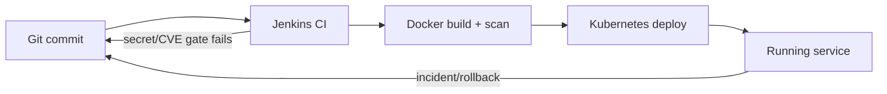

# DevOps for Modern Delivery
### A 2-Day Hands-On Course
Kickoff — Scope, Motivation, and What You'll Build

---

## Why This Course Exists

Most teams don't fail at DevOps because they lack tools — they fail because
the tools aren't wired together, or nobody has practiced the full loop from
commit to running system under pressure.

This course is built around **one continuous pipeline**, not a series of
disconnected tool demos. Everything you do on Day 1 becomes the foundation
for Day 2. By the end, you will have built, broken, and fixed a real
deployment pipeline — not just watched slides about one.

---

## What "DevOps" Means Here

We're not treating DevOps as a job title or a tool list. For this course it
means three things working together:

1. **Fast, safe feedback** — CI catches problems before they reach anyone else
2. **Reproducible environments** — infrastructure and config as code, not tribal knowledge
3. **Observable, recoverable systems** — you can see what broke and roll it back

Every module maps to one of these three pillars.

---

## Course Scope — What's In

- Git branching strategy and CI/CD pipeline design
- Jenkins pipelines: build, test, and report stages
- Docker image builds and image vulnerability scanning
- Kubernetes: deployments, services, rolling updates, rollback
- Terraform for local infrastructure provisioning
- Ansible for host configuration
- DevSecOps gates: dependency scanning, secret scanning
- AI-assisted pipeline review and incident triage
- A capstone: diagnose and fix a real seeded failure end-to-end

---

## Course Scope — What's Out

- Cloud provider–specific services (AWS/GCP/Azure managed offerings)
- Production-grade multi-cluster / multi-region Kubernetes
- Deep dives into any single tool beyond what's needed to complete the pipeline
- Application feature development — the app is a fixed case study, not something you'll extend

This is a **pipeline and platform** course, not an app-development course.

---

## Diagram: The Loop You'll Build

Every module you complete adds one more link in this loop. The capstone asks
you to operate the whole thing under a realistic failure.

---

## Use Case 1: The 2 AM Deploy That Breaks Checkout

**Scenario:** An e-commerce team ships a routine dependency bump. Fifteen
minutes later, checkout starts failing intermittently.

**Discussion prompts:**
- What would have caught this *before* it reached production?
- If nobody can find the last-known-good version fast, what does that cost?
- What's the difference between "we have Kubernetes" and "we can roll back
  in under two minutes"?

This is the shape of Day 2's capstone — you'll live this scenario directly.

---

## Use Case 2: The Vulnerability Everyone Ignored

**Scenario:** A security scanner has been flagging a moderate-severity CVE
in a dependency for three months. Nobody triaged it because it wasn't
blocking the pipeline.

**Discussion prompts:**
- Should a CI pipeline ever *block* on a finding automatically? Always, or
  only above some severity?
- Who owns the decision to accept a risk vs. fix it — the pipeline, or a
  person?
- What's the cost of scan fatigue vs. the cost of one real miss?

This maps directly to the Docker/image-security and DevSecOps modules.

---

## Use Case 3: The Secret in Git History

**Scenario:** A hardcoded credential is discovered in a script that's been
in the repo for a year. It's never been rotated.

**Discussion prompts:**
- Does deleting the line from the current file fix the problem?
- What does "the secret is in history, not just the working tree" actually
  mean for remediation?
- How do you gate against this happening again without slowing every commit
  down?

You'll find and reason about a real instance of this later in the course.

---

## How the Two Days Are Structured

**Day 1** — build the pipeline components: Git strategy, Jenkins CI, Docker
+ image security, Kubernetes fundamentals, and a first AI-assisted review.

**Day 2** — connect them to real infrastructure: Terraform, Ansible,
full Kubernetes deploy/rollback, DevSecOps gates, and the capstone — a
seeded failure you diagnose and fix using everything from Day 1.

Nothing in Day 2 works without Day 1's pieces being in place — treat each
lab's output as the next lab's starting point.

---

## Before We Start: Discussion

Take 5 minutes at your table:

1. Which of the three use cases just now has happened to you or your team —
   in some form?
2. Which of the three DevOps pillars (fast feedback, reproducibility,
   observability/recovery) is weakest where you currently work?
3. What would you personally consider a "win" by the end of Day 2?

We'll come back to these answers during the closing architecture review.

---

# Let's Build It
### Module 1: DevOps Transformation →
