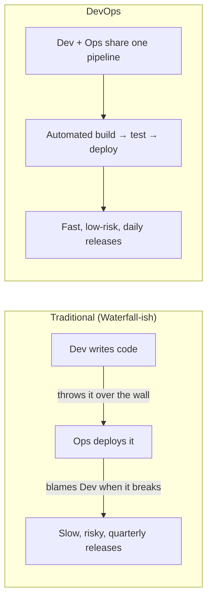
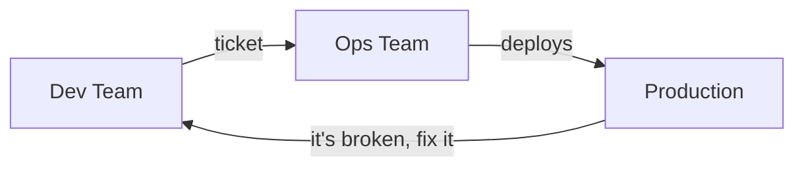
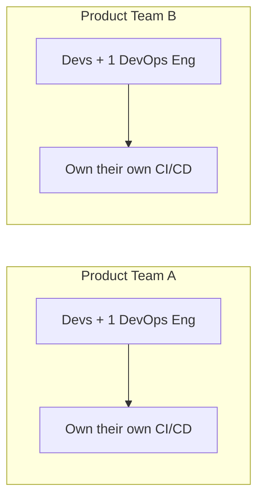
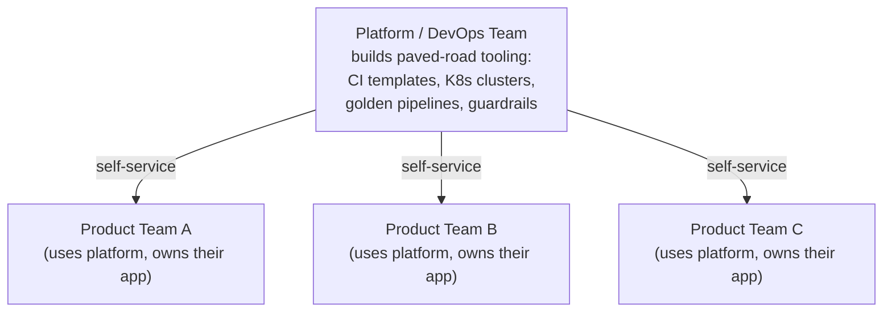
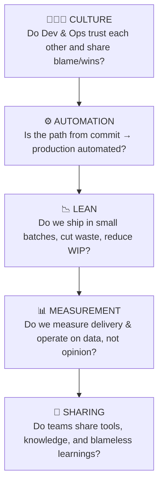
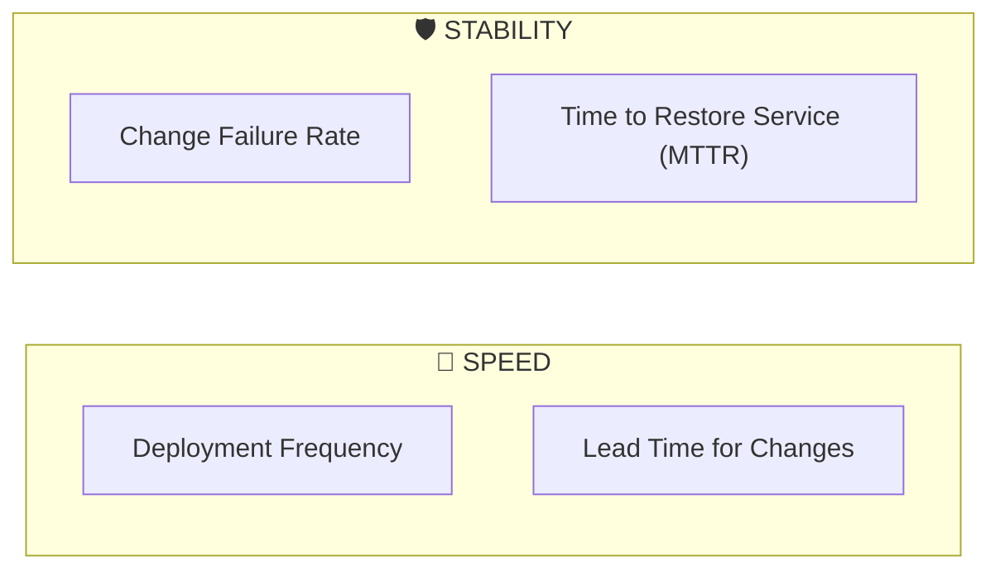
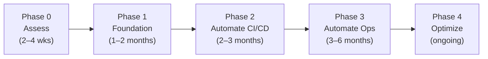
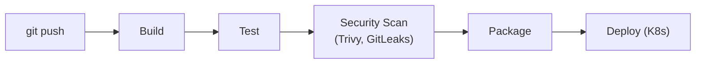

# DevOps Operating Model, Maturity & Metrics — A Practical Guide

A working reference for understanding how DevOps teams should be structured (operating model), how to measure DevOps maturity (CALMS), how to measure delivery performance (DORA metrics), and how to actually roll DevOps out in an organization.

---

## 1. What "DevOps" Actually Means

DevOps is not a tool or a job title — it's a set of practices and a culture that closes the gap between the people who **build** software (Dev) and the people who **run** it (Ops), so that changes move from a developer's laptop to production quickly, safely, and repeatedly.

The point of everything below — operating models, CALMS, DORA — is to make that right-hand picture real.

---

## 2. DevOps Operating Models

An "operating model" answers one question: **who owns the pipeline, and how do Dev and Ops actually work together day to day?** There is no single correct answer — the right model depends on team size, product complexity, and organizational maturity.

### 2.1 Model A — Dev and Ops Silos (Anti-pattern, starting point for many orgs)

Example: A developer finishes a feature, files a change-request ticket, and waits three days for the ops team to schedule a deployment window. If it fails, ops throws it back over the wall. This is the model DevOps was invented to fix.

### 2.2 Model B — Embedded DevOps (Ops engineers inside product teams)

Example: Each squad has its own Jenkins pipeline and its own Kubernetes namespace, and a DevOps engineer sits in their sprint planning. Fast and autonomous, but pipelines and standards drift apart across teams if there's no shared foundation.

### 2.3 Model C — Platform Team / "DevOps as a Platform" (most common at scale)

Example: The platform team publishes a reusable Jenkinsfile template and a Terraform module for spinning up a namespace. Product teams self-serve — they don't file tickets, they just consume the platform. This is the model behind terms like "Internal Developer Platform" and is the direction most mature orgs converge on.

### 2.4 Model D — Site Reliability Engineering (SRE)

A variant of the platform model where a dedicated SRE team owns production reliability using error budgets: if a service is within its reliability target, product teams can ship fast; if it breaches the budget, releases slow down until reliability is restored. Popularized by Google.

| Model | Best for | Risk |
|---|---|---|
| Silos | Never recommended long-term | Slow, blame culture |
| Embedded | Small orgs, few teams | Standards drift |
| Platform team | Mid-to-large orgs, many teams | Platform team can become a bottleneck if not self-service |
| SRE | Large-scale, reliability-critical systems | Requires strong error-budget discipline |

---

## 3. Maturity Dimensions — the CALMS Framework

CALMS is the standard lens for asking "how mature is our DevOps, really?" It looks at five dimensions. An organization can be strong in one and weak in another — maturity isn't all-or-nothing.

**C.A.L.M.S** = **C**ulture · **A**utomation · **L**ean · **M**easurement · **S**haring

### 3.1 Culture

*Low maturity example:* When a deployment breaks production, the postmortem meeting is about finding who to blame.
*High maturity example:* The postmortem is blameless — the team asks "what in our system allowed this mistake to cause an outage?" and fixes the system, not the person.

### 3.2 Automation

*Low maturity example:* A release engineer SSHs into a server and manually runs a deploy script at 11pm.
*High maturity example:* A `git push` to `main` triggers a pipeline (e.g., Jenkins) that builds, runs tests, scans the image with Trivy, and rolls out to Kubernetes automatically — no human touches a server.

### 3.3 Lean

*Low maturity example:* Releases are bundled quarterly — 200 changes go out at once, and if something breaks, nobody can tell which of the 200 changes caused it.
*High maturity example:* Each pull request is small and independently deployable; if something breaks, you know exactly which change caused it and can roll it back in minutes.

### 3.4 Measurement

*Low maturity example:* "We think deployments go pretty well" — no data.
*High maturity example:* A dashboard shows deployment frequency, lead time, change failure rate, and MTTR (the DORA metrics — see Section 4) updated automatically from pipeline and incident data.

### 3.5 Sharing

*Low maturity example:* Each team invents its own Dockerfile, its own logging format, its own way of handling secrets — nothing is reused.
*High maturity example:* Teams contribute to and reuse a common library of Helm charts, CI templates, and a shared internal wiki of runbooks.

### 3.6 Maturity Levels (how to score yourself)

| Level | Culture | Automation | Lean | Measurement | Sharing |
|---|---|---|---|---|---|
| **1 – Initial** | Blame-driven, siloed | Manual deploys | Big-bang quarterly releases | No metrics tracked | No reuse, tribal knowledge |
| **2 – Managed** | Some collaboration | Partial CI, manual deploy step | Monthly releases | Basic uptime/incident counts | Ad-hoc sharing via chat |
| **3 – Defined** | Cross-functional squads | Full CI, manual approval gate to prod | Weekly releases | DORA metrics tracked manually | Shared wikis/templates exist |
| **4 – Measured** | Blameless postmortems | Full CI/CD, automated gates | Daily releases | DORA metrics dashboarded automatically | Reusable platform components |
| **5 – Optimizing** | Continuous experimentation | Self-healing, progressive delivery (canary/blue-green) | On-demand / multiple per day | Metrics drive roadmap decisions | Platform team serves org as a product |

Use this table as a self-assessment: rate your organization 1–5 per column, and the lowest column is usually your best investment target — maturity is bounded by your weakest dimension, not your strongest.

---

## 4. DORA Metrics — Measuring Delivery Performance

DORA (DevOps Research and Assessment, now part of Google Cloud) ran years of industry research and found that elite-performing teams consistently do well on four metrics — split evenly between **speed** and **stability**:

A more recent update (2025) added a fifth metric, **Reliability** (how well a system meets its SLOs), reflecting a shift toward measuring the user-facing outcome, not just the pipeline.

### 4.1 The Metrics, Explained with Examples

**1. Deployment Frequency** — how often you ship to production.
> Example: Team A deploys to production 6 times a day (small, low-risk changes). Team B deploys once a month (one giant release). Team A is far more DevOps-mature by this measure alone.

**2. Lead Time for Changes** — time from `git commit` to that code running in production.
> Example: A bug fix is committed at 10:00am. CI builds, tests, and deploys it automatically; it's live by 10:20am. That's a 20-minute lead time — elite territory. If the same fix instead waits for a weekly change-approval board, lead time might be 5 days.

**3. Change Failure Rate** — the percentage of deployments that cause an incident, rollback, or hotfix.
> Example: Out of 100 deployments last month, 3 caused a production incident → 3% change failure rate.

**4. Time to Restore Service (MTTR)** — how long it takes to recover once something breaks.
> Example: A bad config change takes down checkout at 2:00pm. The team detects it via alerting, rolls back with `kubectl rollout undo`, and service is restored by 2:12pm → 12-minute MTTR.

**5. Reliability (2025 addition)** — whether the system meets its own uptime/error-rate targets (SLOs) over time, not just around deploy events.

### 4.2 Performance Tiers

| Metric | Elite | High | Medium | Low |
|---|---|---|---|---|
| Deployment Frequency | On-demand (multiple/day) | Weekly–monthly | Monthly–biannually | Fewer than every 6 months |
| Lead Time for Changes | Less than 1 hour | 1 day – 1 week | 1 week – 1 month | More than 6 months |
| Change Failure Rate | 0–15% | 16–30% | 16–30% | 16–30%+ |
| Time to Restore Service | Less than 1 hour | Less than 1 day | Less than 1 day | More than 1 week |

(Exact thresholds shift slightly release-to-release of DORA's annual report, but the shape — elite teams ship fast *and* recover fast — is stable.)

### 4.3 Why Speed and Stability Together

A common myth is that shipping faster means breaking more. DORA's research shows the opposite: elite performers are fast **and** stable, because small, frequent, automated, well-tested changes are inherently lower-risk than big infrequent ones. Speed and stability reinforce each other once automation and lean batching (Section 3) are in place.

---

## 5. How to Adopt DevOps — A Practical Roadmap

Adoption is a change-management problem as much as a technical one. Below is a phased approach.

### Phase 0 — Assess (2–4 weeks)
- Score your org against the CALMS table (Section 3.6).
- Baseline your current DORA metrics, even manually (pull dates from deploy logs / incident tickets).
- Pick **one** pilot team and **one** application — don't try to transform the whole org at once.

> Example: Ramanuj's training pilots this with a single service, "OrderFlow-Lite" — a deliberately small, single-service app, because multi-service coordination complexity derails learning focus before the fundamentals land. The same logic applies to real adoption: start with one bounded, low-risk system.

### Phase 1 — Foundation (1–2 months)
- Get everything into version control (app code, infra-as-code, pipeline definitions).
- Establish a shared Definition of Done that includes automated tests.
- Introduce trunk-based development or short-lived feature branches to enable small batches (Lean).

### Phase 2 — Automate the Pipeline (2–3 months)
- Build a CI pipeline: commit → build → unit test → security scan (e.g., Trivy for CVEs, GitLeaks for secrets) → artifact.
- Build CD: automated deploy to a staging environment on every merge; production deploy behind a single approval gate or fully automated for low-risk services.
- Containerize with Docker; if scaling across services, adopt Kubernetes for orchestration.

*(this whole chain = your CI/CD pipeline)*

### Phase 3 — Automate Operations (3–6 months)
- Add observability: centralized logs, metrics, alerting tied to SLOs.
- Practice failure recovery deliberately — inject a realistic, safe failure (e.g., a misconfigured environment variable that stalls processing without crashing or losing data) and have the team diagnose it with `kubectl logs` / `kubectl describe`. Rehearsed incidents build MTTR competence before a real one happens.
- Start tracking DORA metrics automatically via pipeline and incident-tool data.

### Phase 4 — Optimize (ongoing)
- Move from manual approval gates to progressive delivery (canary releases, blue/green, feature flags) as confidence grows.
- Stand up a platform team once you have 3+ product teams, so pipeline/infrastructure patterns become self-service instead of bespoke per team (Section 2.3).
- Revisit the CALMS scorecard quarterly; treat maturity as a continuous loop, not a destination.

### 5.1 Common Pitfalls

| Pitfall | Why it fails | Fix |
|---|---|---|
| Renaming Ops team to "DevOps team" with no process change | Culture and automation didn't actually change | Focus on removing handoffs, not titles |
| Automating a broken process | You just get failures faster | Fix the process first, then automate it |
| Rolling out to all teams simultaneously | No proof point, no learnings to reuse | Pilot with one team, then scale the pattern |
| Tracking DORA metrics as a scoreboard for blame | Kills the psychological safety CALMS depends on | Use metrics to find systemic bottlenecks, not to rank individuals |
| Skipping measurement until "later" | You can't tell if changes are working | Baseline metrics from day one, even manually |

---

## 6. Quick Reference Cheat Sheet

- **Operating model** = who owns the pipeline (silo → embedded → platform team → SRE).
- **CALMS** = the 5 dimensions to assess maturity: Culture, Automation, Lean, Measurement, Sharing.
- **DORA metrics** = the 4 (now 5) outcomes that prove DevOps is working: Deployment Frequency, Lead Time for Changes, Change Failure Rate, Time to Restore Service, (+ Reliability).
- **Adoption** = assess → foundation → automate CI/CD → automate ops → optimize, piloted on one team/app before scaling org-wide.

---

*Sources: DORA (DevOps Research and Assessment) research and 2025 metric updates; CALMS framework as documented by Atlassian and the broader DevOps community.*
