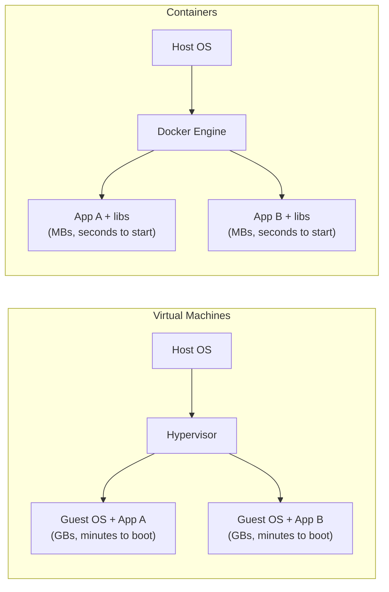
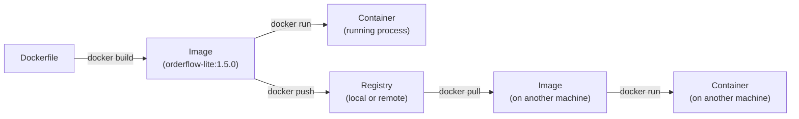
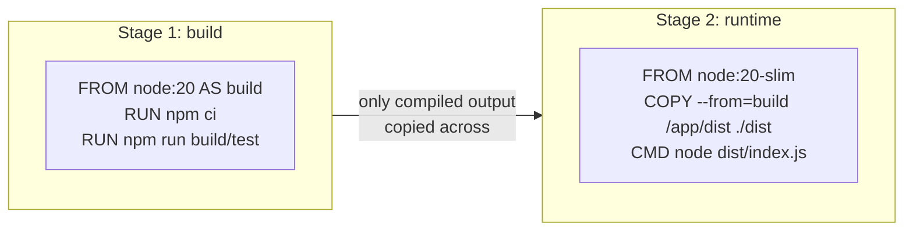
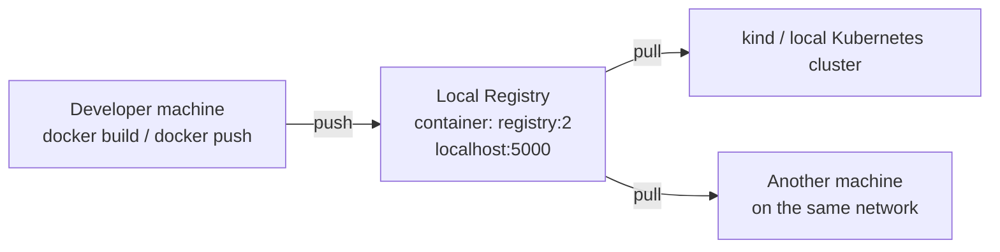

# Docker & Containerization Notes


## 1. Why Containerize

A container packages an application with everything it needs to run (code, runtime, libraries, config) into one portable unit, so "it works on my machine" becomes "it works everywhere."



Containers share the host kernel instead of virtualizing an entire OS per app — that's why they're lighter and faster to start than VMs, and why they're the natural deployment unit for CI/CD (Sections 1–3 of the CI/CD companion doc) and Kubernetes.

---

## 2. Core Concepts

| Concept | What it is | Example |
|---|---|---|
| **Image** | A read-only, layered snapshot of an app + its dependencies — the *blueprint* | `orderflow-lite:1.5.0` |
| **Container** | A running (or stopped) *instance* of an image | `docker run` starts one from the image |
| **Dockerfile** | The recipe used to build an image, layer by layer | Already exists for this app — see Section 4 |
| **Registry** | A server that stores and distributes images (push/pull) | Docker Hub, or your own local registry (Section 6) |
| **Volume** | Persistent storage that outlives a container's lifecycle | MySQL data directory |
| **Network** | Virtual network letting containers talk to each other by name | App container → `mysql` container |



**Image layers and caching:** each instruction in a Dockerfile (`FROM`, `RUN`, `COPY`, ...) creates a cached layer. Docker reuses unchanged layers on rebuild, which is why Dockerfiles typically copy `package.json` and run `npm ci` *before* copying the rest of the source — dependency layers stay cached even when only application code changes.

**Multi-stage builds** (common in a Node.js app's Dockerfile): a `build` stage installs dev dependencies and compiles/tests, and a slim `runtime` stage copies only the production artifacts — keeping the final image small and free of build tooling.



---

## 3. Important Commands

### 3.1 Images

```bash
# Build an image from the existing Dockerfile in the current directory
docker build -t orderflow-lite:1.5.0 .

# Build with a specific Dockerfile path and build-time args
docker build -f Dockerfile -t orderflow-lite:1.5.0 --build-arg NODE_ENV=production .

# List local images
docker images

# Tag an existing image (e.g., for a registry — see Section 6)
docker tag orderflow-lite:1.5.0 localhost:5000/orderflow-lite:1.5.0

# Remove an image
docker rmi orderflow-lite:1.5.0

# Inspect image layers/metadata
docker inspect orderflow-lite:1.5.0
docker history orderflow-lite:1.5.0
```

### 3.2 Containers

```bash
# Run a container, mapping host port 3000 to container port 3000
docker run -d --name orderflow -p 3000:3000 orderflow-lite:1.5.0

# Run with environment variables (matches app config, e.g., DB_HOST)
docker run -d --name orderflow -p 3000:3000 \
  -e DB_HOST=mysql -e DB_NAME=orders \
  orderflow-lite:1.5.0

# List running containers (add -a for stopped ones too)
docker ps
docker ps -a

# View logs (add -f to follow/tail)
docker logs orderflow
docker logs -f orderflow

# Exec into a running container — invaluable for debugging
docker exec -it orderflow sh

# Stop / start / restart / remove
docker stop orderflow
docker start orderflow
docker restart orderflow
docker rm orderflow

# Show live resource usage (CPU, memory) — useful before setting K8s resource limits
docker stats
```

### 3.3 Volumes & Networks

```bash
# Create a named volume for persistent data (e.g., MySQL)
docker volume create orderflow-db-data

# Run MySQL with a persistent volume
docker run -d --name mysql -v orderflow-db-data:/var/lib/mysql \
  -e MYSQL_ROOT_PASSWORD=secret mysql:8

# Create a network so containers can reach each other by name
docker network create orderflow-net
docker run -d --name mysql --network orderflow-net mysql:8
docker run -d --name orderflow --network orderflow-net \
  -e DB_HOST=mysql orderflow-lite:1.5.0
```

### 3.4 Cleanup

```bash
# Remove all stopped containers, unused networks, dangling images
docker system prune

# Include unused volumes too (careful — this deletes data)
docker system prune --volumes
```

### 3.5 Worked Example — OrderFlow-Lite End to End

```bash
# 1. Build the image from the existing Dockerfile
docker build -t orderflow-lite:1.5.0 .

# 2. Start a network + MySQL dependency
docker network create orderflow-net
docker run -d --name mysql --network orderflow-net \
  -e MYSQL_ROOT_PASSWORD=secret -e MYSQL_DATABASE=orders mysql:8

# 3. Run the app container against it
docker run -d --name orderflow --network orderflow-net -p 3000:3000 \
  -e DB_HOST=mysql -e DB_NAME=orders orderflow-lite:1.5.0

# 4. Confirm it's healthy
docker logs -f orderflow
curl http://localhost:3000/health
```

---

## 4. Building from the Existing Dockerfile

Since a `Dockerfile` already exists for the application, day-to-day work is mostly steps 1–3 above: `build` → `run` (or push to a registry and let Kubernetes run it). A couple of things worth checking in an existing Dockerfile before you build against it:

- **Base image pinning** — `FROM node:20.11-slim` (pinned) is safer than `FROM node:latest` (drifts silently over time and breaks the "reliability" DORA dimension from Section 3 of the operating model guide).
- **Non-root user** — a well-written Dockerfile ends with `USER node` (or similar) rather than running the app as root inside the container.
- **`.dockerignore`** — should exclude `node_modules`, `.git`, and test fixtures so the build context stays small and the image doesn't inherit host-only files.

---

## 5. Local Docker Registry Setup

A local registry lets you push/pull images entirely on your machine or lab network — useful for training environments, offline/air-gapped labs, or a local Kubernetes cluster (e.g., `kind`) that needs to pull images without touching Docker Hub.



### 5.1 Start the registry

```bash
# Run the official registry image as a container, with persistent storage
docker run -d \
  --name local-registry \
  --restart=always \
  -p 5000:5000 \
  -v registry-data:/var/lib/registry \
  registry:2
```

### 5.2 Tag and push an image to it

```bash
# Tag your existing image for the local registry
docker tag orderflow-lite:1.5.0 localhost:5000/orderflow-lite:1.5.0

# Push it
docker push localhost:5000/orderflow-lite:1.5.0

# Pull it back down to confirm it round-trips
docker pull localhost:5000/orderflow-lite:1.5.0
```

### 5.3 Verify what's in the registry

```bash
# List repositories in the registry (uses the registry HTTP API)
curl http://localhost:5000/v2/_catalog

# List tags for a specific image
curl http://localhost:5000/v2/orderflow-lite/tags/list
```

### 5.4 Pushing from a remote machine (registry needs TLS or explicit "insecure" trust)

By default, Docker requires registries to serve HTTPS. For a local/lab registry running plain HTTP, tell Docker to trust it explicitly — otherwise you'll see `http: server gave HTTP response to HTTPS client`.

**On Docker Desktop / Docker Engine**, edit `/etc/docker/daemon.json` (Linux) or Docker Desktop's Settings → Docker Engine (macOS/Windows):

```json
{
  "insecure-registries": ["localhost:5000", "192.168.1.50:5000"]
}
```

Then restart Docker: `sudo systemctl restart docker` (Linux) or restart Docker Desktop.

### 5.5 Connecting a local Kubernetes cluster (`kind`) to the local registry

This is the piece that matters for a Kubernetes-based training lab: `kind` runs Kubernetes nodes as Docker containers, so the registry needs to be reachable *from inside those node containers*, not just from your host shell.

```bash
# 1. Create a Docker network shared by kind and the registry (if not already 'kind')
docker network create kind 2>/dev/null || true

# 2. Run (or re-run) the registry attached to that network
docker run -d --name local-registry --restart=always -p 5000:5000 \
  --network kind \
  -v registry-data:/var/lib/registry \
  registry:2

# 3. Point kind's containerd at it via a kind cluster config (kind-config.yaml)
#    containerdConfigPatches tell each node to treat localhost:5000 as the registry mirror
```

`kind-config.yaml` example:

```yaml
kind: Cluster
apiVersion: kind.x-k8s.io/v1alpha4
containerdConfigPatches:
  - |-
    [plugins."io.containerd.grpc.v1.cri".registry.mirrors."localhost:5000"]
      endpoint = ["http://local-registry:5000"]
```

```bash
# 4. Create the cluster with that config
kind create cluster --config kind-config.yaml

# 5. Push an image and reference it in a Kubernetes manifest as:
#    image: localhost:5000/orderflow-lite:1.5.0
kubectl apply -f deployment.yaml
```

### 5.6 Registry cleanup

```bash
# Stop and remove the registry container (data persists in the named volume)
docker stop local-registry && docker rm local-registry

# Delete the volume too if you want a clean slate
docker volume rm registry-data
```

---

## 6. How This Fits the Bigger Picture

- **CI/CD pipeline** (companion doc, Section 2): the "Build" and "Package" quality gates are exactly `docker build` and `docker tag`/`docker push` — usually to a real registry in CI, but a local registry is how you rehearse the same flow offline or in training.
- **GitOps** (companion doc, Section 4): the image tag pushed to the registry is what gets referenced in the config repo's manifest — GitOps only changes *how* the new tag reaches the cluster, not how the image itself gets built and pushed.
- **Rollback**: because registries are immutable-by-tag, rolling back is often just re-pointing a deployment at a previously pushed tag (e.g., `localhost:5000/orderflow-lite:1.4.0`) rather than rebuilding anything.

---

