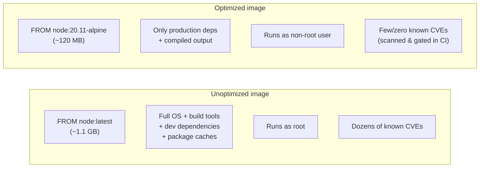
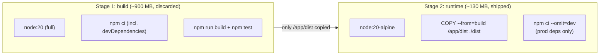
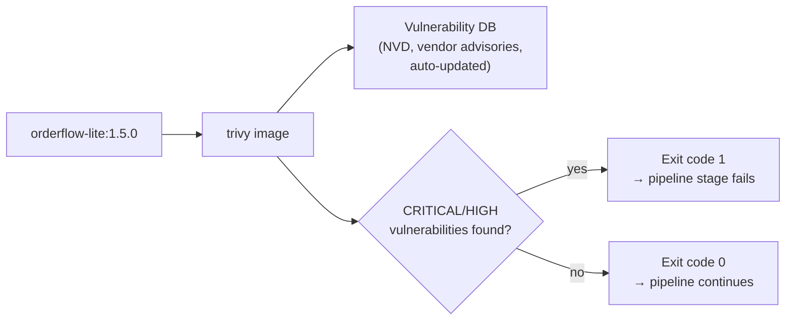
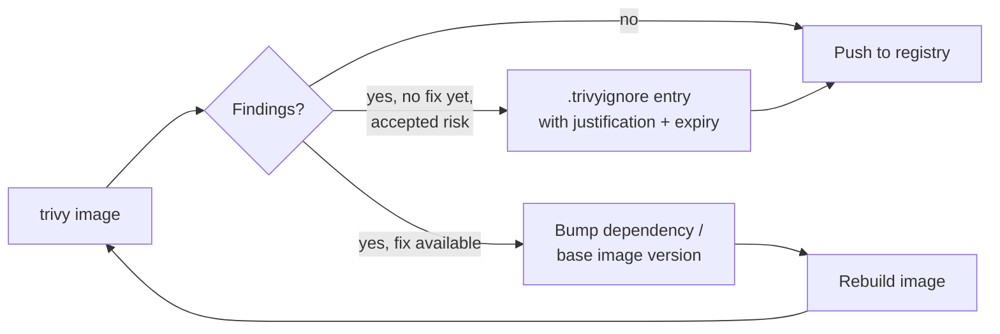
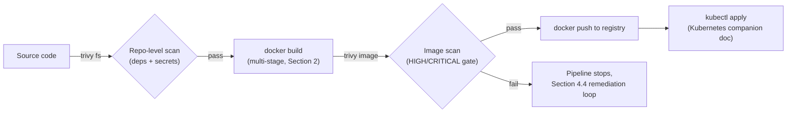

# Docker Image Optimization & Security — Trivy Scanning


## 1. Why This Matters

A bloated, root-running, unpinned image costs you in three ways: slower pulls/deploys (hurts Deployment Frequency and Lead Time, main guide Section 4), a bigger attack surface (more packages = more CVEs), and unpredictable builds (`latest` tags drift). Optimization and security are really the same exercise — a smaller image is usually also a safer one, because there's less in it that could be vulnerable.



---

## 2. Image Optimization

### 2.1 Choose a Minimal, Pinned Base Image

| Base image style | Example | Size | Trade-off |
|---|---|---|---|
| Full OS | `node:20` (Debian-based) | ~1 GB | Most compatible, most bloat, most CVEs |
| Slim | `node:20-slim` | ~200 MB | Debian minus docs/extra packages — usually the sweet spot |
| Alpine | `node:20-alpine` | ~120 MB | musl libc instead of glibc — smallest common option, occasional native-module incompatibility |
| Distroless | `gcr.io/distroless/nodejs20` | ~120 MB, no shell | No package manager, no shell at all — smallest attack surface, harder to `exec` into for debugging |

**Always pin the tag** (`node:20.11-alpine`, not `node:latest`) — `latest` silently changes over time, breaking reproducible builds and the "reliability" DORA dimension covered in the main operating model guide.

### 2.2 Multi-Stage Builds (recap + optimization angle)

The Docker companion doc (Section 2) introduced multi-stage builds for separating build and runtime concerns. The optimization payoff: the final image contains *only* what's copied across in the last `COPY --from=build` — none of the compilers, dev dependencies, or test tooling from the build stage survive into the shipped image.



```dockerfile
# --- Stage 1: build ---
FROM node:20.11 AS build
WORKDIR /app
COPY package*.json ./
RUN npm ci
COPY . .
RUN npm run build && npm test

# --- Stage 2: runtime ---
FROM node:20.11-alpine
WORKDIR /app
COPY package*.json ./
RUN npm ci --omit=dev
COPY --from=build /app/dist ./dist
USER node
EXPOSE 3000
CMD ["node", "dist/index.js"]
```

### 2.3 Layer Ordering & Caching

Order instructions from **least-frequently-changing to most-frequently-changing**. Dependency installs (`package.json` rarely changes) belong before source code (`COPY . .`, changes every commit) — otherwise every code change invalidates the dependency-install cache layer too, and every build reinstalls `node_modules` from scratch.

```dockerfile
# Good: package.json copied and installed first — this layer stays cached
# across builds where only application code changed.
COPY package*.json ./
RUN npm ci
COPY . .          # changes every commit, but doesn't bust the npm ci cache above
```

### 2.4 Other Size Reducers

- **`.dockerignore`** — exclude `node_modules`, `.git`, `*.md`, test fixtures, local `.env` files from the build context (and, transitively, from any layer that does `COPY . .`).
- **Combine `RUN` instructions** where it reduces layers meaningfully, and clean up package-manager caches in the *same* `RUN` (a `rm -rf` in a later layer doesn't shrink earlier layers — the deleted files are still in the image history):
  ```dockerfile
  RUN apt-get update && apt-get install -y curl \
      && rm -rf /var/lib/apt/lists/*
  ```
- **Don't install dev/build tooling in the final stage at all** — that's what the multi-stage split in Section 2.2 already buys you.

### 2.5 Measuring the Result

```bash
docker images orderflow-lite          # compare sizes across tags
docker history orderflow-lite:1.5.0   # see the size contribution of each layer
```

---

## 3. Security Hardening

| Practice | Why | Example |
|---|---|---|
| Run as non-root | Limits blast radius if the container is compromised | `USER node` at the end of the Dockerfile |
| Read-only root filesystem | Prevents an attacker (or a bug) from writing to the container filesystem at runtime | `docker run --read-only ...` / Kubernetes `securityContext.readOnlyRootFilesystem: true` |
| Drop Linux capabilities | Containers get a reduced-but-still-broad capability set by default; drop what's unused | `docker run --cap-drop=ALL --cap-add=NET_BIND_SERVICE ...` |
| No secrets baked into layers | A secret in an earlier `RUN`/`ENV`/`ARG` layer is recoverable from the image history even if a later layer removes it | Pass secrets at runtime (env, Kubernetes Secret — see the Kubernetes companion doc, Section 6), never `ARG API_KEY=...` |
| Pin base image digest, not just tag | Tags can be re-pushed; a digest (`@sha256:...`) can't | `FROM node:20.11-alpine@sha256:abc123...` |
| Minimal installed packages | Fewer packages = fewer CVEs to track | Alpine/distroless base (Section 2.1); avoid `apt-get install` of anything not strictly needed at runtime |
| Scan before you ship | Catch known CVEs before they reach a registry or cluster | Trivy (Section 4) |

```dockerfile
FROM node:20.11-alpine
WORKDIR /app
COPY package*.json ./
RUN npm ci --omit=dev
COPY --from=build /app/dist ./dist
USER node                     # non-root
EXPOSE 3000
CMD ["node", "dist/index.js"]
```

```bash
# Run with hardening flags applied at the container-run level too
docker run -d --name orderflow \
  --read-only \
  --cap-drop=ALL --cap-add=NET_BIND_SERVICE \
  --tmpfs /tmp \
  -p 3000:3000 \
  orderflow-lite:1.5.0
```

---

## 4. Trivy Image Scanning

Trivy (by Aqua Security) scans container images, filesystems, and Git repos for known CVEs in OS packages and language dependencies, plus misconfigurations and exposed secrets. It's the tool referenced as the "Security Scan" quality gate in both the CI/CD companion doc (Section 2) and the Jenkinsfile in the Jenkins companion doc (Section 5.3).



### 4.1 Install

```bash
# macOS
brew install aquasecurity/trivy/trivy

# Linux (Debian/Ubuntu)
sudo apt-get install wget apt-transport-https gnupg lsb-release
wget -qO - https://aquasecurity.github.io/trivy-repo/deb/public.key | sudo gpg --dearmor -o /usr/share/keyrings/trivy.gpg
echo "deb [signed-by=/usr/share/keyrings/trivy.gpg] https://aquasecurity.github.io/trivy-repo/deb $(lsb_release -sc) main" | sudo tee -a /etc/apt/sources.list.d/trivy.list
sudo apt-get update && sudo apt-get install trivy

# Or run it as a container — no install needed, useful inside a Jenkins agent
docker run --rm -v /var/run/docker.sock:/var/run/docker.sock \
  aquasec/trivy image orderflow-lite:1.5.0
```

### 4.2 Core Commands

```bash
# Scan an image (the most common use)
trivy image orderflow-lite:1.5.0

# Scan an image already in a registry, without pulling it locally first
trivy image localhost:5000/orderflow-lite:1.5.0

# Only fail on HIGH/CRITICAL severities (typical CI gate)
trivy image --severity HIGH,CRITICAL --exit-code 1 orderflow-lite:1.5.0

# Scan the filesystem/repo directly (catches issues before you even build an image)
trivy fs --severity HIGH,CRITICAL --exit-code 1 .

# Scan for exposed secrets too
trivy image --scanners vuln,secret orderflow-lite:1.5.0

# Output as JSON (for parsing) or SARIF (for GitHub code-scanning integration)
trivy image -f json -o results.json orderflow-lite:1.5.0
trivy image -f sarif -o results.sarif orderflow-lite:1.5.0

# Generate a Software Bill of Materials (SBOM)
trivy image --format cyclonedx --output sbom.json orderflow-lite:1.5.0
```

### 4.3 Example Output (abridged)

```
orderflow-lite:1.5.0 (alpine 3.19.1)
=====================================
Total: 2 (HIGH: 1, CRITICAL: 1)

┌─────────────┬────────────────┬──────────┬──────────┬───────────────┬───────────────┐
│   Library   │ Vulnerability  │ Severity │ Status   │ Installed Ver │ Fixed Version │
├─────────────┼────────────────┼──────────┼──────────┼───────────────┼───────────────┤
│ axios       │ CVE-2024-XXXXX │ CRITICAL │ affected │ 0.21.1        │ 0.21.4        │
│ node        │ CVE-2023-YYYYY │ HIGH     │ affected │ 20.9.0        │ 20.11.0       │
└─────────────┴────────────────┴──────────┴──────────┴───────────────┴───────────────┘
```

An exit code of `1` here is exactly what makes the Jenkins "Security Scan" stage in the Jenkins companion doc (Section 5.3) turn red and stop the pipeline before the vulnerable image ever gets pushed to the registry.

### 4.4 Handling Findings

```bash
# Remediate: bump the affected dependency to the fixed version, rebuild, rescan
npm install axios@0.21.4
docker build -t orderflow-lite:1.5.1 .
trivy image --severity HIGH,CRITICAL --exit-code 1 orderflow-lite:1.5.1
```



If a CVE has no fix yet and the team accepts the risk (e.g., low exploitability in this context), suppress it explicitly and visibly rather than silently — a `.trivyignore` file, with a comment explaining why and a reminder to revisit:

```
# .trivyignore
# CVE-2024-XXXXX: no upstream fix yet, low-severity path unreachable in our usage.
# Revisit by 2026-09-01.
CVE-2024-XXXXX
```

```bash
trivy image --ignorefile .trivyignore --severity HIGH,CRITICAL --exit-code 1 orderflow-lite:1.5.0
```

### 4.5 Filesystem/Secret Scanning (pre-build, catches more than just images)

```bash
# Scan the repo for both dependency CVEs and leaked secrets before a build even runs
trivy fs --scanners vuln,secret,misconfig --severity HIGH,CRITICAL .
```

This is the earliest possible gate — catching a hardcoded secret or a vulnerable dependency in source before Docker even builds an image, which is cheaper than catching it after (Section 1's "fail fast and cheap" principle from the CI/CD companion doc, Section 2).

---

## 5. Where This Fits the Pipeline



This slots directly into the Jenkinsfile's `stage('Security Scan')` (Jenkins companion doc, Section 5.3) — the `trivy fs` command there could be extended to `trivy image` right after the `docker build` stage for an additional, image-specific gate before the push.

---

