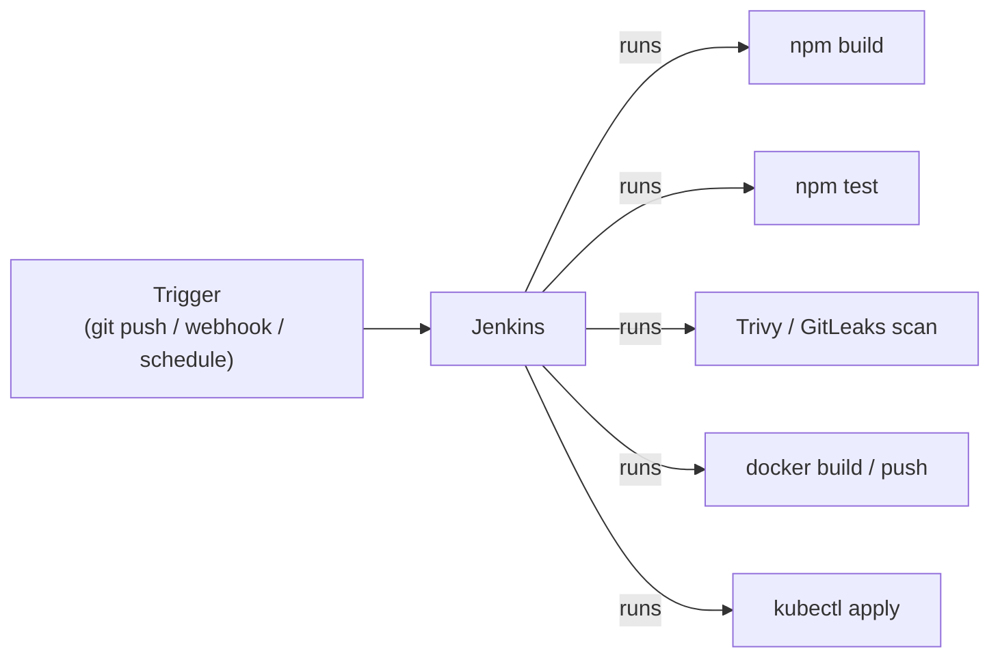
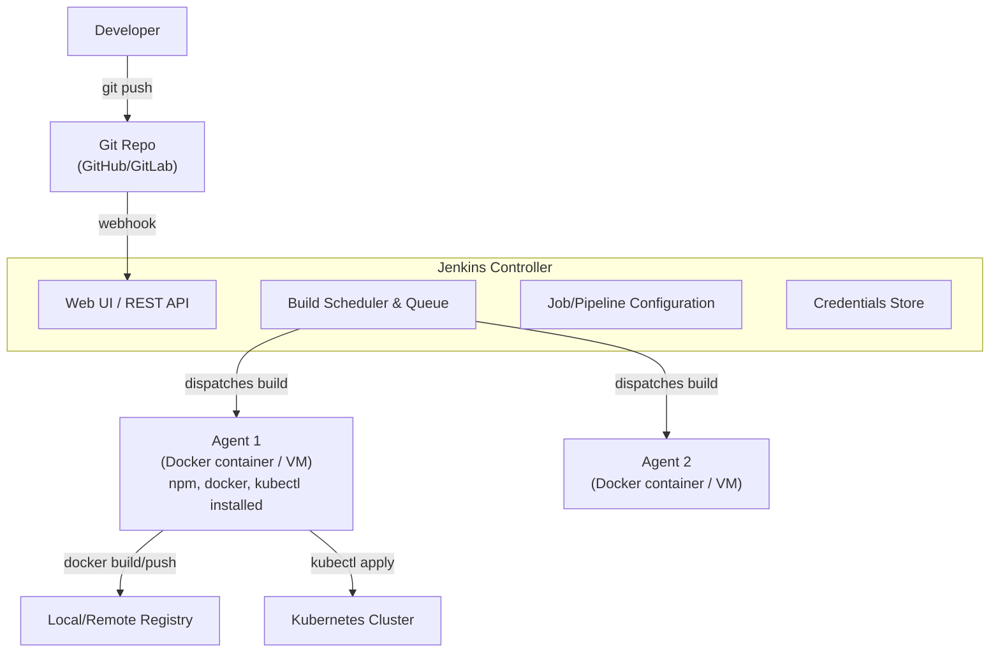
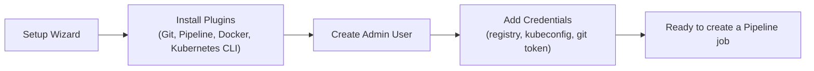
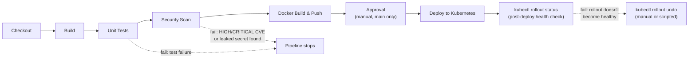

# Jenkins Basics — Concepts, Architecture, Setup & Pipeline Walkthrough


## 1. What Jenkins Is

Jenkins is an open-source **automation server**: it watches for triggers (a `git push`, a schedule, a webhook) and runs a defined sequence of steps — the CI/CD pipeline described conceptually in the CI/CD companion doc, Sections 1–3. Jenkins itself doesn't know how to build, test, or deploy anything; it just orchestrates *other* tools (npm, Docker, Trivy, kubectl) in the right order, on the right trigger, with the right pass/fail gating.



---

## 2. Core Concepts

| Concept | What it is |
|---|---|
| **Job / Project** | A configured unit of work Jenkins can run (e.g., "build and deploy OrderFlow-Lite") |
| **Pipeline** | A job defined as code — a sequence of **stages**, each made of **steps** — usually stored in a `Jenkinsfile` alongside the app |
| **Jenkinsfile** | The text file (Groovy-based DSL) that defines a Pipeline; committed to the app's Git repo, so the pipeline is version-controlled like everything else |
| **Stage** | A logical phase of the pipeline shown as a block in the UI (e.g., "Build", "Test", "Deploy") |
| **Step** | A single action inside a stage (e.g., `sh 'npm test'`) |
| **Build / Run** | One execution of a Pipeline, triggered by a commit, webhook, schedule, or manual click — gets a build number (`#42`) |
| **Agent (Node)** | A machine (or container) that actually executes the steps; the Jenkins controller schedules work onto agents |
| **Executor** | A slot on an agent that can run one build at a time; an agent can have multiple executors |
| **Plugin** | Jenkins core is deliberately minimal — Git integration, Docker support, Kubernetes agent provisioning, credential types, etc. all come from plugins |
| **Credentials Store** | Jenkins' built-in secrets manager for registry passwords, kubeconfig, SSH keys, API tokens — referenced by ID in the Jenkinsfile, never hardcoded |
| **Webhook** | A callback Git hosting (GitHub/GitLab/Bitbucket) sends to Jenkins the moment a push happens, so Jenkins doesn't have to poll |

**Declarative vs. Scripted Pipeline syntax:** Declarative (the modern, recommended style — a structured `pipeline { stages { ... } }` block) is what this doc uses throughout. Scripted pipeline is the older, more flexible but more error-prone Groovy-script style — still supported, rarely the right default choice for new pipelines.

---

## 3. Architecture — Controller and Agents

Jenkins uses a **controller/agent (formerly "master/slave")** model: the controller schedules work and serves the UI; agents actually execute pipeline steps. This separation matters for two reasons — isolation (each build gets a clean environment) and scale (add more agents to run more builds in parallel).



**Local/lab setup pattern:** the controller itself runs as a Docker container, and either (a) that same container runs builds directly ("built-in node" — fine for small labs), or (b) additional agent containers register with the controller so builds get a clean, disposable environment each time and don't pollute the controller. The Kubernetes companion doc's local registry setup and cluster are what Agent 1 above talks to for the Docker/K8s stages.

---

## 4. Local Setup (Docker-based)

Running Jenkins itself as a container is the fastest way to get a working controller for a training lab or local pipeline.

```bash
# 1. Create a volume so Jenkins config/jobs survive container restarts
docker volume create jenkins-data

# 2. Create a network so Jenkins can reach the local registry and, if needed, a kind cluster
docker network create jenkins-net 2>/dev/null || true

# 3. Run the Jenkins LTS controller
docker run -d \
  --name jenkins \
  --network jenkins-net \
  -p 8080:8080 -p 50000:50000 \
  -v jenkins-data:/var/jenkins_home \
  -v /var/run/docker.sock:/var/run/docker.sock \
  jenkins/jenkins:lts

# 4. Get the initial admin password (needed for first-time setup wizard)
docker exec jenkins cat /var/jenkins_home/secrets/initialAdminPassword
```

Mounting `/var/run/docker.sock` lets pipeline steps run `docker build`/`docker push` using the *host's* Docker engine — the common (if slightly unsafe-in-production, fine-for-a-lab) way to give Jenkins container-building ability without nesting Docker-in-Docker.

**First-time setup wizard** (`http://localhost:8080`):
1. Paste the initial admin password from step 4 above.
2. Choose "Install suggested plugins" (covers Git, Pipeline, Credentials basics).
3. Create the first admin user.
4. Additionally install: **Docker Pipeline** plugin (for `docker.build()` steps) and **Kubernetes CLI** plugin (for `kubectl` steps), via *Manage Jenkins → Plugins*.

**Register credentials** (*Manage Jenkins → Credentials → System → Global credentials*):
- `registry-creds` — username/password (or token) for the local Docker registry, if it requires auth.
- `kubeconfig-cred` — "Secret file" type, containing the cluster's kubeconfig, so pipeline steps can run `kubectl` against it.
- `github-token` — for pulling private repos / setting commit statuses back on GitHub.



---

## 5. Walkthrough: Creating a Pipeline

### 5.1 Create the Job

1. Jenkins dashboard → **New Item**.
2. Enter a name (e.g., `orderflow-lite-pipeline`), select **Pipeline**, click OK.
3. Under **Build Triggers**, check **GitHub hook trigger for GITScm polling** (so a push fires the build via webhook instead of Jenkins polling on a timer).
4. Under **Pipeline**, set **Definition** to **Pipeline script from SCM**:
   - SCM: Git
   - Repository URL: the app's repo
   - Credentials: `github-token` (from Section 4)
   - Script Path: `Jenkinsfile` (default — the file lives at the repo root)
5. Save.

This "Pipeline script from SCM" setting is what makes the pipeline itself version-controlled: Jenkins re-reads the `Jenkinsfile` from the repo on every run, so pipeline changes go through the same PR/review process as application code (tying back to the branching model in the CI/CD companion doc, Section 1).

### 5.2 Set Up the Webhook (GitHub example)

In the GitHub repo: **Settings → Webhooks → Add webhook**
- Payload URL: `http://<jenkins-host>:8080/github-webhook/`
- Content type: `application/json`
- Trigger on: **Just the push event**

Now every `git push` notifies Jenkins immediately, instead of Jenkins polling the repo on an interval — this is what makes "Lead Time for Changes" (DORA metric, main guide Section 4) short.

### 5.3 Write the Jenkinsfile

Commit this at the repo root as `Jenkinsfile`. It mirrors the quality-gate flowchart from the CI/CD companion doc, Section 2 — build → test → security scan → package (Docker build/push) → approval → deploy → post-deploy health check.

```groovy
pipeline {
    agent any

    environment {
        REGISTRY   = "localhost:5000"
        IMAGE_NAME = "orderflow-lite"
        IMAGE_TAG  = "${env.BUILD_NUMBER}"
    }

    stages {

        stage('Checkout') {
            steps {
                checkout scm
            }
        }

        stage('Build') {
            steps {
                sh 'npm ci'
                sh 'npm run build'
            }
        }

        stage('Unit Tests') {
            steps {
                sh 'npm test -- --coverage'
            }
            post {
                always {
                    junit 'reports/junit.xml'
                }
            }
        }

        stage('Security Scan') {
            steps {
                sh 'trivy fs --exit-code 1 --severity HIGH,CRITICAL .'
                sh 'gitleaks detect --source . --exit-code 1'
            }
        }

        stage('Docker Build & Push') {
            steps {
                sh "docker build -t ${REGISTRY}/${IMAGE_NAME}:${IMAGE_TAG} ."
                sh "docker push ${REGISTRY}/${IMAGE_NAME}:${IMAGE_TAG}"
            }
        }

        stage('Approval') {
            when { branch 'main' }
            steps {
                input message: "Deploy build ${IMAGE_TAG} to production?", ok: 'Deploy'
            }
        }

        stage('Deploy to Kubernetes') {
            when { branch 'main' }
            steps {
                withCredentials([file(credentialsId: 'kubeconfig-cred', variable: 'KUBECONFIG')]) {
                    sh """
                        kubectl set image deployment/orderflow-lite \
                          orderflow=${REGISTRY}/${IMAGE_NAME}:${IMAGE_TAG}
                        kubectl rollout status deployment/orderflow-lite --timeout=120s
                    """
                }
            }
        }
    }

    post {
        failure {
            echo "Pipeline failed — see stage logs above. No deployment occurred if it failed before 'Deploy to Kubernetes'."
        }
        success {
            echo "Build ${IMAGE_TAG} deployed successfully."
        }
    }
}
```

### 5.4 Run It

- **Automatically:** push a commit — the webhook (Section 5.2) triggers a build within seconds.
- **Manually:** dashboard → the job → **Build Now**.
- Watch progress via the **Stage View**, which renders each `stage{}` block as a colored box (green = passed, red = failed, the pipeline visualization most people picture when they think "Jenkins").



If any stage fails, Jenkins marks the build red, stops the pipeline at that stage (later stages don't run), and — if a webhook back to GitHub is configured — posts the failure as a commit status check, blocking the PR from merging.

---

## 6. How This Fits the Bigger Picture

- **Docker companion doc**: the "Docker Build & Push" stage above is exactly the `docker build` / `docker tag` / `docker push` sequence from that doc's Sections 3 and 5, run by a Jenkins agent instead of by hand.
- **Kubernetes companion doc**: "Deploy to Kubernetes" uses `kubectl set image` + `kubectl rollout status`, the same commands from that doc's Section 8 (Rolling Updates) — Jenkins is just the thing invoking them on a trigger instead of a person typing them.
- **CI/CD companion doc, Section 2 (Quality Gates)**: each `stage{}` above corresponds one-to-one to a gate in that doc's flowchart; a failed `sh` step or a non-zero exit code from Trivy/GitLeaks is what makes a gate "fail" in Jenkins terms.
- **CI/CD companion doc, Section 3 (Rollback)**: if the post-deploy health check fails, the same `kubectl rollout undo` command applies — either run manually by on-call, or added as an automatic step in the `post { failure { ... } }` block once the team trusts the automation.
- **GitOps (CI/CD companion doc, Section 4)**: this Jenkinsfile uses a **push-based** deploy (`kubectl apply`/`set image` run directly by Jenkins). A GitOps-based pipeline would instead have Jenkins stop after "Docker Build & Push" and commit the new image tag to a config repo — letting Argo CD/Flux pull and apply it, rather than Jenkins holding cluster credentials at all.

---
