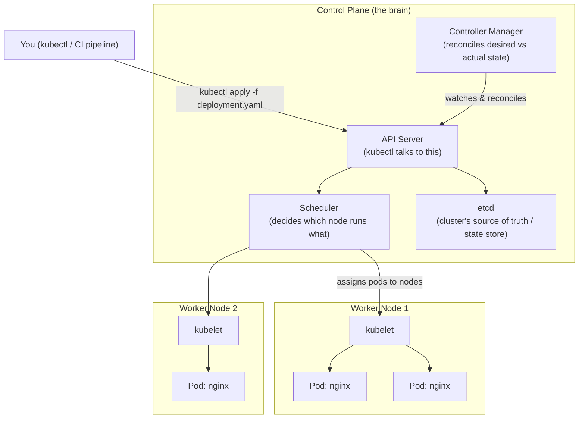
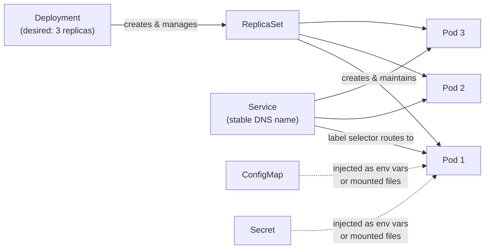
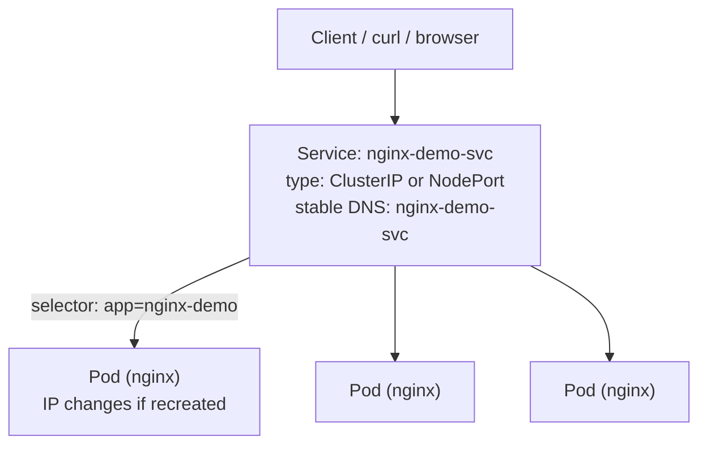
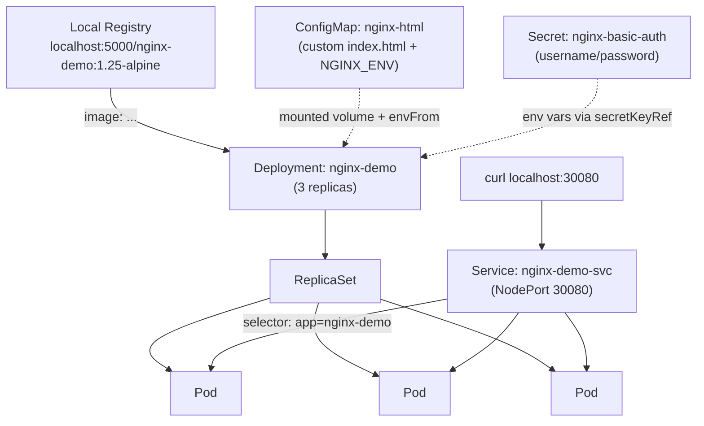

# Kubernetes Basics — Deploy & Manage a Containerized App Locally


## 1. Kubernetes Basics

### 1.1 What Problem It Solves

Docker (previous companion doc) runs *one container on one machine*. Kubernetes is the layer above that: it schedules containers across a *cluster* of machines, restarts them when they crash, scales them up and down, and gives them stable networking — so you stop thinking about individual containers and start thinking about *desired state* ("I want 3 copies of nginx running, always").

### 1.2 Cluster Architecture



For a local cluster (`kind`, Minikube, Docker Desktop's Kubernetes), the control plane and worker node(s) usually all run as containers or one VM on your own machine — same architecture, smaller scale.

### 1.3 Core Objects

| Object | What it is | Analogy |
|---|---|---|
| **Pod** | The smallest deployable unit — one or more containers that share networking/storage | A single "instance" of your app |
| **Deployment** | Declares "I want N replicas of this Pod template running, and keep them that way" — manages rolling updates & rollbacks | A supervisor that keeps the right number of instances alive |
| **ReplicaSet** | Created automatically by a Deployment; the thing that actually keeps N pods running | The Deployment's worker, rarely touched directly |
| **Service** | A stable network endpoint (fixed name/IP) that load-balances traffic across matching Pods, even as Pods come and go | A permanent phone number that always reaches whichever pods are currently alive |
| **ConfigMap** | Non-sensitive configuration (env vars, config files) injected into Pods | An external `.env` file the cluster manages |
| **Secret** | Like a ConfigMap, but for sensitive data (passwords, tokens, certs) — base64-encoded at rest, access-controlled | A locked version of the `.env` file |
| **Namespace** | A virtual partition inside a cluster to separate environments/teams | Folders for organizing objects |



---

## 2. Prep: Tag and Push nginx to the Local Registry

Rather than pulling nginx from Docker Hub every time, push it through the local registry set up in the Docker companion doc (Section 5) — this is also exactly the pattern you'd use for a real application image built in CI.

```bash
# 1. Pull the public nginx image
docker pull nginx:1.25-alpine

# 2. Tag it for the local registry
docker tag nginx:1.25-alpine localhost:5000/nginx-demo:1.25-alpine

# 3. Push it to the local registry
docker push localhost:5000/nginx-demo:1.25-alpine

# 4. Confirm it's there
curl http://localhost:5000/v2/nginx-demo/tags/list
```

If your Kubernetes cluster is `kind` (as configured in the Docker companion doc, Section 5.5), it can already resolve `localhost:5000` via the containerd mirror — manifests below reference the image as `localhost:5000/nginx-demo:1.25-alpine`. If you're using Minikube or Docker Desktop's Kubernetes instead, `nginx:1.25-alpine` pulled directly from Docker Hub works just as well for this demo; swap the image name in the YAML.

---

## 3. Deployments

A Deployment describes the Pod template (which image, ports, resources) and how many replicas you want. Kubernetes continuously reconciles reality to match it.

### 3.1 Imperative

```bash
# Create a Deployment directly from an image (quick, for learning/demos)
kubectl create deployment nginx-demo \
  --image=localhost:5000/nginx-demo:1.25-alpine \
  --replicas=3

# Check status
kubectl get deployments
kubectl get pods -l app=nginx-demo
kubectl describe deployment nginx-demo
```

### 3.2 Declarative — `deployment.yaml`

```yaml
apiVersion: apps/v1
kind: Deployment
metadata:
  name: nginx-demo
  labels:
    app: nginx-demo
spec:
  replicas: 3
  selector:
    matchLabels:
      app: nginx-demo
  template:
    metadata:
      labels:
        app: nginx-demo
    spec:
      containers:
        - name: nginx
          image: localhost:5000/nginx-demo:1.25-alpine
          ports:
            - containerPort: 80
          resources:
            requests:
              cpu: "50m"
              memory: "64Mi"
            limits:
              cpu: "200m"
              memory: "128Mi"
          readinessProbe:
            httpGet:
              path: /
              port: 80
            initialDelaySeconds: 3
          livenessProbe:
            httpGet:
              path: /
              port: 80
            initialDelaySeconds: 10
```

```bash
kubectl apply -f deployment.yaml
kubectl get pods -l app=nginx-demo -o wide
```

The `selector.matchLabels` on the Deployment must match `template.metadata.labels` on the Pod — this is how the ReplicaSet knows which Pods belong to it, and it's the same label a Service will use to find these Pods (Section 4).

---

## 4. Services

Pods are ephemeral — they get new IPs every time they're recreated. A Service gives you a stable name and IP that always routes to the currently-healthy Pods matching its selector.



| Service type | Reachable from | Typical use |
|---|---|---|
| `ClusterIP` (default) | Inside the cluster only | Internal service-to-service traffic |
| `NodePort` | Outside the cluster, via `<any-node-ip>:<30000-32767>` | Simple local/dev access without a load balancer |
| `LoadBalancer` | Outside the cluster, via a cloud provider's LB | Production, on a cloud platform |

### 4.1 Imperative

```bash
# Expose the Deployment as a NodePort Service (accessible from your host machine)
kubectl expose deployment nginx-demo \
  --name=nginx-demo-svc \
  --port=80 \
  --target-port=80 \
  --type=NodePort

kubectl get svc nginx-demo-svc
```

### 4.2 Declarative — `service.yaml`

```yaml
apiVersion: v1
kind: Service
metadata:
  name: nginx-demo-svc
spec:
  type: NodePort
  selector:
    app: nginx-demo
  ports:
    - port: 80
      targetPort: 80
      nodePort: 30080
```

```bash
kubectl apply -f service.yaml

# Access it
kubectl get svc nginx-demo-svc
curl http://localhost:30080          # kind/Minikube with port mapped
# or, from anywhere with cluster access, use port-forward instead:
kubectl port-forward svc/nginx-demo-svc 8080:80
curl http://localhost:8080
```

---

## 5. ConfigMaps

ConfigMaps hold non-sensitive configuration, decoupled from the image — the same nginx image can serve different content or config purely by changing the ConfigMap, without rebuilding the image.

**Demo: replace nginx's default welcome page with a custom `index.html` via a ConfigMap mounted as a volume.**

### 5.1 Imperative

```bash
# Create a ConfigMap directly from a local file
echo "<h1>Hello from OrderFlow-Lite training lab (ConfigMap-served)</h1>" > index.html
kubectl create configmap nginx-html --from-file=index.html

kubectl get configmap nginx-html -o yaml
```

### 5.2 Declarative — `configmap.yaml`

```yaml
apiVersion: v1
kind: ConfigMap
metadata:
  name: nginx-html
data:
  index.html: |
    <html>
      <body>
        <h1>Hello from OrderFlow-Lite training lab (ConfigMap-served)</h1>
      </body>
    </html>
  NGINX_ENV: "training-lab"
```

```bash
kubectl apply -f configmap.yaml
```

### 5.3 Mounting the ConfigMap into the Deployment

```yaml
# deployment.yaml — updated to mount the ConfigMap and consume an env var from it
spec:
  template:
    spec:
      containers:
        - name: nginx
          image: localhost:5000/nginx-demo:1.25-alpine
          ports:
            - containerPort: 80
          envFrom:
            - configMapRef:
                name: nginx-html          # exposes NGINX_ENV as an env var
          volumeMounts:
            - name: html-volume
              mountPath: /usr/share/nginx/html
      volumes:
        - name: html-volume
          configMap:
            name: nginx-html
            items:
              - key: index.html
                path: index.html
```

```bash
kubectl apply -f deployment.yaml
kubectl rollout status deployment/nginx-demo
curl http://localhost:30080   # should now show the custom HTML
```

---

## 6. Secrets

Secrets work like ConfigMaps but are meant for sensitive values — base64-encoded at rest and access-restricted via RBAC. **Base64 is encoding, not encryption** — don't commit raw Secret YAML with real values to Git; in a GitOps setup, use a sealed/external-secrets tool instead (see the CI/CD companion doc, Section 4, for the GitOps repo pattern this would plug into).

**Demo: add HTTP Basic Auth to the nginx demo using a Secret for the credentials.**

### 6.1 Imperative

```bash
# Create a Secret from literal values (kubectl base64-encodes it for you)
kubectl create secret generic nginx-basic-auth \
  --from-literal=username=trainee \
  --from-literal=password='ChangeMe123!'

kubectl get secret nginx-basic-auth -o yaml
# Decode a value to verify:
kubectl get secret nginx-basic-auth -o jsonpath='{.data.password}' | base64 -d
```

### 6.2 Declarative — `secret.yaml`

```yaml
apiVersion: v1
kind: Secret
metadata:
  name: nginx-basic-auth
type: Opaque
stringData:            # stringData lets you write plaintext; K8s encodes it on create
  username: trainee
  password: ChangeMe123!
```

```bash
kubectl apply -f secret.yaml
```

### 6.3 Consuming the Secret as Environment Variables

```yaml
# deployment.yaml — inject Secret values as env vars alongside the ConfigMap
spec:
  template:
    spec:
      containers:
        - name: nginx
          image: localhost:5000/nginx-demo:1.25-alpine
          envFrom:
            - configMapRef:
                name: nginx-html
          env:
            - name: BASIC_AUTH_USER
              valueFrom:
                secretKeyRef:
                  name: nginx-basic-auth
                  key: username
            - name: BASIC_AUTH_PASS
              valueFrom:
                secretKeyRef:
                  name: nginx-basic-auth
                  key: password
          volumeMounts:
            - name: html-volume
              mountPath: /usr/share/nginx/html
      volumes:
        - name: html-volume
          configMap:
            name: nginx-html
```

```bash
kubectl apply -f deployment.yaml

# Verify the env vars landed inside a running pod
kubectl exec -it deploy/nginx-demo -- env | grep BASIC_AUTH
```

(A production nginx image would use these values in an `nginx.conf` `.htpasswd` setup rather than raw env vars — the point here is demonstrating how a Secret's data reaches a container, not building production-grade auth.)

---

## 7. Full Picture: How It All Connects



Apply everything in one shot (order matters — ConfigMap/Secret should exist before the Deployment that references them):

```bash
kubectl apply -f configmap.yaml
kubectl apply -f secret.yaml
kubectl apply -f deployment.yaml
kubectl apply -f service.yaml

kubectl get all -l app=nginx-demo
```

---

## 8. Managing the Application

### 8.1 Scaling

```bash
# Imperative
kubectl scale deployment nginx-demo --replicas=5

# Declarative — just change `replicas: 5` in deployment.yaml and re-apply
kubectl apply -f deployment.yaml

kubectl get pods -l app=nginx-demo -w   # watch pods come up
```

### 8.2 Rolling Updates

```bash
# Push a new image tag through the local registry first (Section 2 pattern)
docker tag nginx:1.27-alpine localhost:5000/nginx-demo:1.27-alpine
docker push localhost:5000/nginx-demo:1.27-alpine

# Trigger a rolling update by changing the image
kubectl set image deployment/nginx-demo nginx=localhost:5000/nginx-demo:1.27-alpine

# Watch the rollout progress — old pods terminate as new ones become ready
kubectl rollout status deployment/nginx-demo
kubectl rollout history deployment/nginx-demo
```

### 8.3 Rollback

This is the Kubernetes-native version of the rollback strategies covered in the CI/CD companion doc, Section 3.

```bash
# Roll back to the previous revision
kubectl rollout undo deployment/nginx-demo

# Or roll back to a specific revision number from `rollout history`
kubectl rollout undo deployment/nginx-demo --to-revision=2

kubectl rollout status deployment/nginx-demo
```

### 8.4 Debugging

```bash
kubectl get pods -l app=nginx-demo
kubectl describe pod <pod-name>          # events, scheduling issues, probe failures
kubectl logs <pod-name>
kubectl logs -f deploy/nginx-demo        # follow logs across the deployment
kubectl exec -it <pod-name> -- sh        # shell into a running container
kubectl top pod -l app=nginx-demo        # live CPU/memory (requires metrics-server)
```

### 8.5 Cleanup

```bash
kubectl delete -f service.yaml
kubectl delete -f deployment.yaml
kubectl delete -f configmap.yaml
kubectl delete -f secret.yaml

# Or, if everything shares the app=nginx-demo label:
kubectl delete all -l app=nginx-demo
kubectl delete configmap nginx-html
kubectl delete secret nginx-basic-auth
```

---

## 9. How This Fits the Bigger Picture

- **Docker companion doc**: the image referenced in every manifest here (`localhost:5000/nginx-demo:...`) is exactly the build → tag → push flow from that doc's Sections 3 and 5.
- **CI/CD companion doc, Section 2 (Quality Gates)**: the "post-deploy health check" gate maps to the `readinessProbe`/`livenessProbe` fields on the Deployment — Kubernetes won't route Service traffic to a Pod until its readiness probe passes.
- **CI/CD companion doc, Section 3 (Rollback)**: `kubectl rollout undo` here is the same command referenced there for Kubernetes rolling-update rollback.
- **CI/CD companion doc, Section 4 (GitOps)**: these YAML files (`deployment.yaml`, `service.yaml`, `configmap.yaml`, `secret.yaml`) are exactly what would live in a GitOps config repo, with an agent like Argo CD applying them instead of running `kubectl apply` by hand.

---

