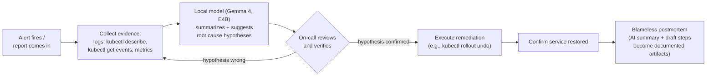
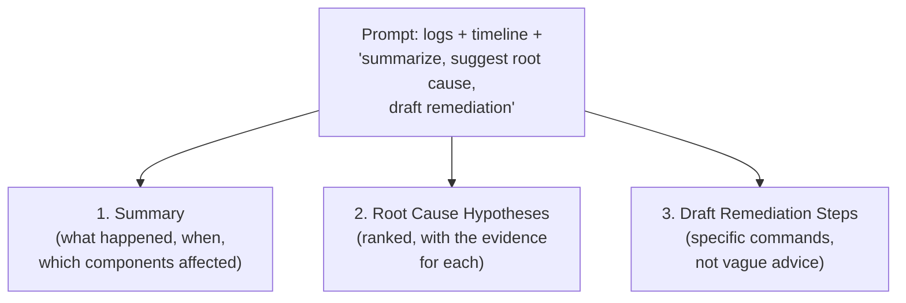
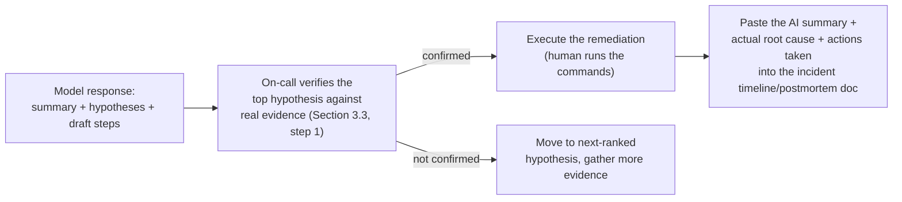

# AI-Assisted Incident Analysis

---

## 1. Why This Matters During an Incident

MTTR — Time to Restore Service (main operating model guide, Section 4) — is largely a function of how fast you can go from "something's wrong" to "here's what's wrong and here's the fix." The slow part is usually reading: scrolling through hundreds of log lines under time pressure, across multiple pods/containers, while people are asking for updates. Summarizing that noise quickly is exactly the kind of task a local LLM is well suited for — **as an accelerant for a human responder, not a replacement for one.**



This reuses the same local setup from the pipeline-review companion doc (Docker Model Runner running `ai/gemma4:E4B`) — see that doc's Section 2 for install/setup if you haven't already. The safety guardrails there (Section 5 of that doc) apply here too, with a few incident-specific additions in Section 5 below.

---

## 2. The Three-Part Ask: Summarize, Hypothesize, Draft

Structure the prompt around exactly the three outputs you need, so the model doesn't wander — a log dump alone tends to produce a rambling response, while an explicit three-part ask produces something directly usable.



---

## 3. Worked Example: OrderFlow-Lite Incident

Reusing the ConfigMap-typo scenario from the CI/CD companion doc (Section 3) and the AI pipeline-review doc (Section 3) — but now from the *incident-response* angle: orders are stuck, and it's 2am, and you don't yet know why.

### 3.1 Collect Evidence

```bash
# Recent pod logs
kubectl logs deploy/orderflow-lite --since=30m > incident-logs.txt

# Pod events — often shows scheduling/config issues logs alone won't
kubectl describe pod -l app=orderflow-lite > incident-describe.txt

# Recent cluster events, sorted by time
kubectl get events --sort-by='.lastTimestamp' -n default > incident-events.txt

# Rollout history — did a deploy correlate with the incident start?
kubectl rollout history deployment/orderflow-lite > incident-rollout-history.txt
```

### 3.2 Prompt the Local Model

```bash
docker model run ai/gemma4:E4B "$(cat <<EOF
We have an incident: orders in our app are stuck in 'pending' status and
never move to 'completed'. It started roughly 30 minutes ago. Here is our
evidence:

=== Pod logs (last 30 min) ===
$(cat incident-logs.txt)

=== kubectl describe pod output ===
$(cat incident-describe.txt)

=== Recent cluster events ===
$(cat incident-events.txt)

=== Rollout history ===
$(cat incident-rollout-history.txt)

Please provide:
1. A concise summary of what's happening (2-3 sentences).
2. Ranked root cause hypotheses, with the specific evidence supporting each.
3. Draft remediation steps for the most likely hypothesis, as exact commands.
EOF
)"
```

### 3.3 Representative Model Response

> **1. Summary:** The `orderflow-lite` Deployment's pods are running and passing liveness/readiness probes, but orders submitted after approximately 30 minutes ago are not transitioning out of `pending`. No pod restarts or crash events are visible, suggesting the application process is alive but not completing its background processing work — likely a downstream dependency (database connection) issue rather than an application crash.
>
> **2. Root cause hypotheses (ranked):**
> - **(Most likely) Database connection misconfiguration.** The logs show repeated `ECONNREFUSED` or connection-timeout-style messages referencing a hostname that doesn't match your `mysql` service name. Cross-reference the `DB_HOST` environment variable actually injected into the pod (`kubectl exec <pod> -- env | grep DB_`) against your ConfigMap's key spelling — a mismatched or misspelled env var name is a common cause of exactly this "runs fine, but can't reach its dependency" pattern.
> - **(Possible) Recent rollout correlates with incident start.** The rollout history shows a new revision was deployed roughly 30 minutes ago, matching when the issue began. If the previous revision didn't have this problem, that's strong evidence the new revision's config (not the code) is the cause.
> - **(Less likely) MySQL itself is down or overloaded.** No corroborating evidence in the events you've shared — worth a quick check but doesn't match the "app appears healthy" pattern as well as the first hypothesis.
>
> **3. Draft remediation steps (for the config-mismatch hypothesis):**
> ```bash
> # Confirm the actual env var name/value inside a running pod
> kubectl exec -it deploy/orderflow-lite -- env | grep DB_
>
> # Compare against the ConfigMap's actual key
> kubectl get configmap orderflow-config -o yaml
>
> # If a mismatch is confirmed, fix the ConfigMap or Deployment manifest,
> # commit the fix, and redeploy — or, for immediate relief while the
> # permanent fix goes through review, roll back to the last known-good revision:
> kubectl rollout undo deployment/orderflow-lite
> kubectl rollout status deployment/orderflow-lite
> ```

Notice the response explicitly cites **which piece of evidence** supports each hypothesis, and offers both the diagnostic step (confirm before acting) and two remediation paths (permanent fix vs. immediate rollback) — that's the pattern to prompt for, not just "what's wrong."

---

## 4. What to Do With the Output



- **Verify before executing** — the model's "most likely" hypothesis is a starting point, not a diagnosis. Run the confirming command it suggested (`env | grep DB_` in the example) and look at the actual output yourself before running any remediation command.
- **A human runs the remediation commands.** Nothing here should be wired to auto-execute against a live cluster, especially not during an active incident when the blast radius of a wrong automated action is highest.
- **Keep the AI output as a timeline artifact**, not a replacement for the postmortem. Paste the summary and hypotheses into your incident channel/doc as a timestamped entry — it's useful context for whoever writes the postmortem, but the postmortem itself still needs the *actual* confirmed root cause and the *actual* fix, not just what the model guessed.

---

## 5. Safe Use — Incident-Specific Additions

Everything in the pipeline-review companion doc's Section 5 (verify against authoritative tools, don't paste secrets, don't blindly apply suggested changes) applies here too. A few additions specific to the incident-response context:

- **Redact before pasting, even faster than usual.** Incident logs are exactly where customer identifiers, session tokens, or connection strings tend to show up unexpectedly (a stack trace that happens to include a query string, for instance). Scan the log excerpt yourself before pasting, even into a local model — the urgency of an incident is exactly when this step gets skipped, which is when it matters most.
- **Don't let the model's confidence outpace your evidence.** A fluent, specific-sounding hypothesis is not the same as a correct one — small local models can be especially prone to sounding certain about a plausible-but-wrong cause. The ranked-hypothesis-with-evidence format (Section 3.3) exists specifically so you can sanity-check "does the evidence they cited actually say what they claim it says?"
- **Time-box it.** If a first pass at summarization doesn't point anywhere useful within a couple of minutes, fall back to manual triage rather than iterating on prompts while the incident continues — during an active incident, a slow correct process beats a fast uncertain one.
- **Never let it near destructive commands unsupervised.** Draft remediation steps are exactly that — drafts. `kubectl delete`, `kubectl rollout restart`, database migrations, or anything irreversible gets read and understood by a human before it runs, every time, incident or not.
- **Post-incident, capture what actually happened vs. what the model suggested** as a specific postmortem note — did the top hypothesis turn out right? That's useful signal for how much to trust this workflow next time, and it keeps the blameless-postmortem culture (main operating model guide, Section 3.1) focused on the system and the process, not on "the AI told us wrong" as a excuse or "the AI told us right" as an substitute for the team's own verification.

---

## 6. How This Fits the Bigger Picture

- **Main operating model guide, Section 4 (DORA metrics)**: this workflow is aimed squarely at MTTR — faster, better-informed triage without skipping the verification step that keeps a fast response from becoming a wrong one.
- **CI/CD companion doc, Section 3 (Rollback)**: the draft remediation in Section 3.3 above ends at exactly the rollback commands documented there — this doc is about getting to the right command faster, not a different remediation mechanism.
- **AI pipeline-review companion doc**: same local model, same safety posture, same "hypothesis generator, not oracle" framing — that doc is for pre-commit review, this one is for live incidents. Setup (Section 2 there) isn't repeated here.
- **Main operating model guide, Section 3.1 (Culture)**: keeping AI-drafted hypotheses and remediation as documented, verifiable artifacts in the postmortem — rather than an unverified claim someone acted on — is what keeps this practice compatible with a blameless, evidence-based incident culture.

---

