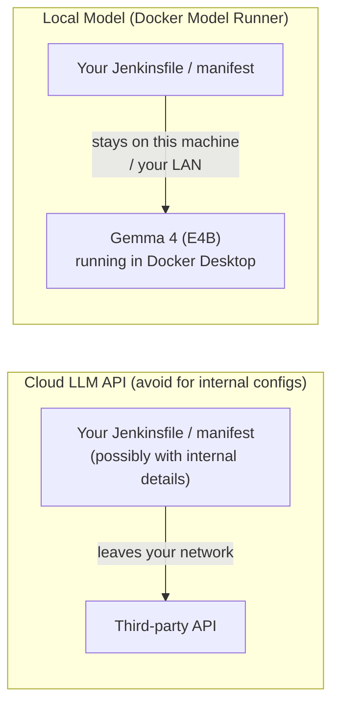
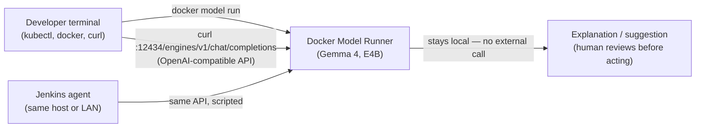
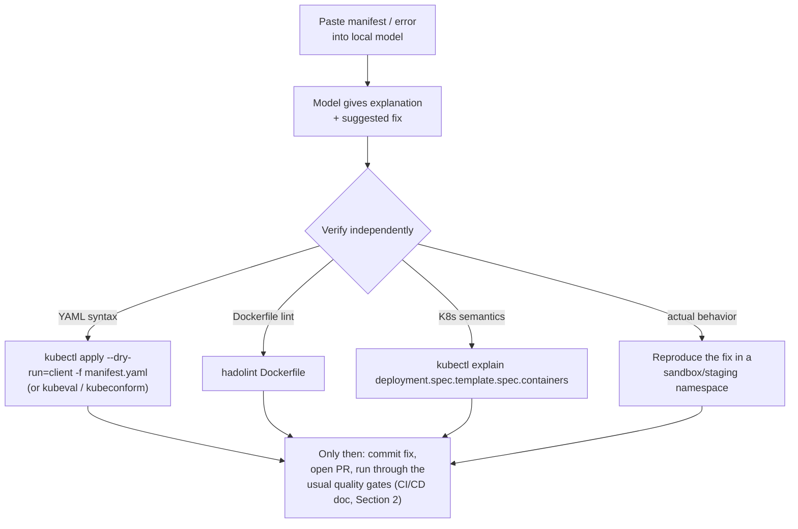

# AI-Assisted Pipeline Review with a Local Model


---

## 1. Why a Local Model for This

Pipeline configs, Dockerfiles, and Kubernetes manifests often contain internal hostnames, registry paths, image naming conventions, and occasionally secrets that shouldn't leave the building. Sending them to a public cloud LLM API for "just explain this error" quietly creates a data-exfiltration risk. Running the model **locally** (or on a shared machine inside your own network) avoids that entirely — nothing leaves the host, no API key, no per-token cost, works fully offline.



**Docker Model Runner (DMR)** is a built-in Docker Desktop feature that runs open-weight LLMs (like Gemma 4) as a local inference engine, managed and distributed the same way you already manage container images — `docker model pull`, `docker model run`, an OpenAI-compatible REST API. That reuses tooling and mental models this whole training track already covers.

---

## 2. Setup

### 2.1 Enable and Pull the Model

```bash
# Docker Desktop 4.40+ ships Model Runner; enable it if not already on
# (Docker Desktop → Settings → AI → Enable Docker Model Runner, or via CLI:)
docker desktop enable model-runner

# Pull Gemma 4, E4B ("Effective 4B") variant — small/efficient, built for
# edge devices and local dev machines (small enough to run comfortably on a laptop)
docker model pull ai/gemma4:E4B

# Confirm it's available locally
docker model list
```

> Gemma 4 support in Docker Model Runner is newer than Gemma 3's — if `docker model run` reports an unrecognized model architecture, update Docker Desktop to the latest version first (Model Runner added Gemma 4 support shortly after the model's release).

### 2.2 Quick Interactive Test

```bash
docker model run ai/gemma4:E4B "Explain what a Kubernetes readinessProbe does in one sentence."
```

### 2.3 Enable the Local API (for scripting/tooling integration)

```bash
# Expose the OpenAI-compatible endpoint on the host (off by default)
# Docker Desktop → Settings → AI → Enable host-side TCP support (port 12434)
curl http://localhost:12434/engines/v1/models
```



From inside a container (e.g., a Jenkins agent container), the same model is reachable at `http://model-runner.docker.internal/engines/v1/...` instead of `localhost` — useful if you later want a pipeline stage to call it (with the safeguards in Section 5, not as an auto-merge gate).

---

## 3. Worked Example: Reviewing a Kubernetes Manifest Defect

Reusing the ConfigMap scenario referenced elsewhere in this training track (Kubernetes companion doc, and the capstone failure pattern): a typo in an env var name silently stalls order processing.

**The broken manifest** (`configmap.yaml` + `deployment.yaml` excerpt):

```yaml
apiVersion: v1
kind: ConfigMap
metadata:
  name: orderflow-config
data:
  DB_HOST: "mysql"          # correct key
  DB_NAME: "orders"
---
apiVersion: apps/v1
kind: Deployment
metadata:
  name: orderflow-lite
spec:
  template:
    spec:
      containers:
        - name: orderflow
          image: localhost:5000/orderflow-lite:1.5.0
          envFrom:
            - configMapRef:
                name: orderflow-config
          env:
            - name: DB_HSOT          # <-- typo: should be DB_HOST
              valueFrom:
                configMapKeyRef:
                  name: orderflow-config
                  key: DB_HOST
```

**Prompt to the local model:**

```bash
docker model run ai/gemma4:E4B "$(cat <<'EOF'
I have a Kubernetes Deployment that references a ConfigMap. The app's orders
are stuck in 'pending' status and never move to 'completed'. Here is the
manifest — what's wrong with it?

<paste configmap.yaml + deployment.yaml here>
EOF
)"
```

**Representative model response:**

> The Deployment defines an environment variable named `DB_HSOT`, which appears to be a typo of `DB_HOST`. Because `DB_HSOT` doesn't match the key your application code actually reads (`DB_HOST`), the app likely falls back to a default or empty database host value, causing connection failures or silent stalls rather than a crash. Check your application's env-var name against the manifest exactly (case- and spelling-sensitive) — `kubectl exec` into the pod and run `env | grep DB_` to confirm what's actually being injected, and compare it to what the app expects in its config-loading code.

This is a genuinely useful "second pair of eyes" catch — a one-character typo in a 40-line manifest is exactly the kind of thing that's tedious to visually diff but trivial for a model to flag when asked directly. The value here is **explanation and hypothesis generation**, not authority — Section 5 covers why you still verify it yourself.

---

## 4. Worked Example: Explaining a Docker Build Error

```bash
docker build -t orderflow-lite:1.6.0 . 2> build-error.log
cat build-error.log
```

```
ERROR [runtime 4/6] COPY --from=build /app/dist ./dist
failed to compute cache key: "/app/dist" not found: not found
```

```bash
docker model run ai/gemma4:E4B "$(cat <<EOF
My multi-stage Docker build fails with this error:

$(cat build-error.log)

Here is my Dockerfile:

$(cat Dockerfile)

What's the likely cause?
EOF
)"
```

**Representative model response:**

> The error means the `build` stage never produced a `/app/dist` directory for the `runtime` stage to copy. Common causes: (1) the build stage's `RUN npm run build` step failed silently or was skipped — check its exit code and logs above this error; (2) your `package.json` build script outputs to a different directory (e.g., `build/` instead of `dist/`) — check the `outDir`/build config; (3) the `COPY --from=build` stage name doesn't match the `AS build` alias used earlier in the Dockerfile — verify both spellings match exactly. I'd start by running just the build stage in isolation (`docker build --target build -t debug-build .` then `docker run -it debug-build sh` and `ls /app`) to see what actually got produced.

Notice the response gives **concrete verification steps**, not just a guess — that's the pattern to prompt for (Section 5.3) rather than accepting a bare assertion.

---

## 5. Safe Use of an AI Assistant for This Work

An LLM explaining your YAML or build error is a **hypothesis generator**, not a linter or a source of truth. Treat it accordingly.

### 5.1 What NOT to paste in, even to a local model

- Real secrets, passwords, private keys, or `.kubeconfig` credentials — redact or replace with placeholders (`<REDACTED>`) before pasting, as a matter of habit that also protects you if the model ever *is* a shared/logged one.
- Customer data or anything appearing in logs alongside the error (scrub PII from log excerpts).
- If the model is genuinely local (Section 2), the risk is lower than a cloud API, but "local now" doesn't guarantee "never logged or shared later" — keep the redaction habit regardless.

### 5.2 Verify, don't trust



- **Cross-check against authoritative tools, not just the model's word**: `kubectl explain <field>` for API semantics, `kubectl apply --dry-run=client -f file.yaml` for validity, `hadolint` for Dockerfile lint rules, `docker build --check` for build-config warnings. A local E4B model is small and fast, not infallible — it can misstate field names or invent plausible-sounding but wrong YAML.
- **Never apply an AI-suggested manifest change directly to a live cluster.** Run it through the same pipeline quality gates as any other change (CI/CD companion doc, Section 2) — a `dry-run`, a diff review, and, for anything touching production, the same approval gate a human-authored change would need.
- **Don't let it near credentials rotation or RBAC changes unsupervised** — those are exactly the categories where a plausible-but-wrong suggestion (over-broad `Role` permissions, for instance) is costly and easy to rubber-stamp if you're not reading closely.

### 5.3 Prompting Habits That Improve Reliability

- Give it the **actual error text and actual file contents**, not a paraphrase — models reason much better over concrete text than a vague description ("my pod won't start").
- Ask it to **explain its reasoning and suggest a verification step**, not just hand you a fixed file to paste back in blind — the two worked examples above (Sections 3–4) both end with "here's how to confirm" rather than "here's the fix, trust me."
- For anything more than a one-line typo fix, ask for **a diff or a specific line change**, not a full file rewrite — full rewrites are where models most often silently drop something (a probe, a resource limit, a label) that mattered.
- Treat repeated or structural issues (the same typo class recurring across manifests) as a signal to fix the *process* — a schema-validation step in CI (`kubeconform`/`kubeval`, or a pre-commit hook) — not just the individual instance.

---

## 6. How This Fits the Bigger Picture

- **CI/CD companion doc, Section 2 (Quality Gates)**: AI review is a *pre-commit, human-facing aid* — it sits before the pipeline, helping a developer understand a failure faster. It is not a replacement for the automated build/test/security-scan/health-check gates, which remain the actual enforcement mechanism.
- **Jenkins companion doc**: nothing here changes the Jenkinsfile itself — AI-assisted review is something a developer does at their terminal (or, later, a Jenkins stage that *posts* an explanation as a PR comment for a human to read, never one that auto-applies a fix).
- **Kubernetes / Docker companion docs**: the worked examples above (Sections 3–4) reuse the exact ConfigMap-typo and multi-stage-build patterns already introduced there — this doc is about the *review workflow*, not new infrastructure concepts.

