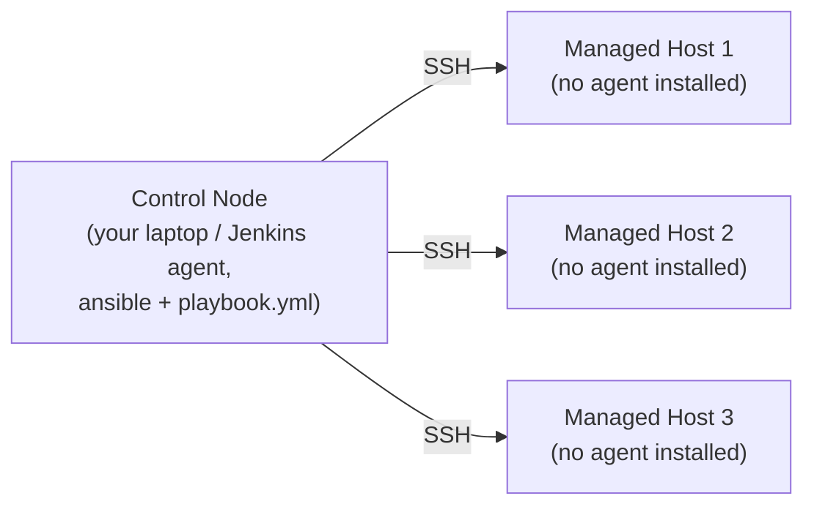
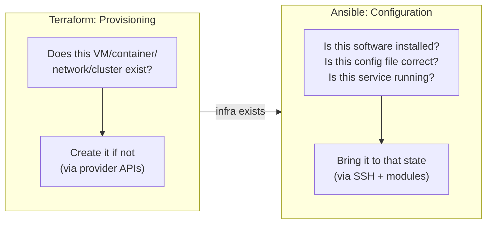
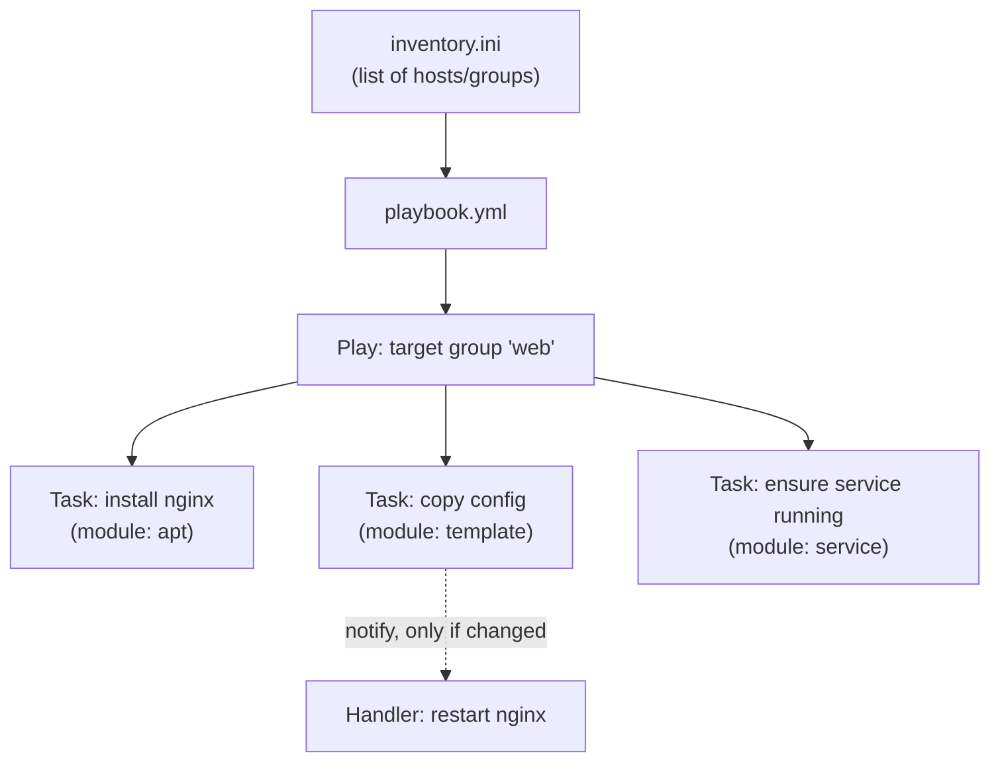
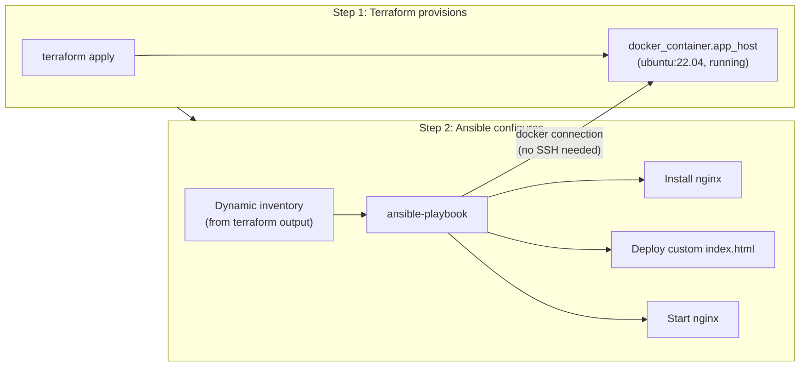

# Ansible 

---

## 1. What Ansible Is

Ansible is a **configuration management and automation tool**: it connects to existing machines (over SSH, WinRM, or a container connection) and brings them to a desired state — installing packages, writing config files, starting services, deploying application code. Where Terraform's job (Terraform companion doc) is "make this infrastructure exist," Ansible's job is "make what's running on this infrastructure look like this."

**Agentless** is the key architectural fact: there's no persistent Ansible daemon running on the machines it manages. Ansible connects over SSH, pushes small Python scripts (called *modules*) to execute the requested change, and disconnects — nothing to install, patch, or keep running on every target host.



---

## 2. Ansible vs. Terraform — the Core Distinction

Both are IaC tools, both are declarative-ish, and they're frequently used together rather than as alternatives — but they solve different halves of the same problem.



| | Terraform | Ansible |
|---|---|---|
| **Primary job** | Provisioning — create/destroy infrastructure (VMs, networks, clusters, DNS records, cloud resources) | Configuration management — install packages, manage files, start services, deploy apps onto infrastructure that already exists |
| **Execution model** | Talks to platform **APIs** (cloud provider, Docker daemon, Kubernetes API) | Connects **into** machines over SSH/WinRM and runs modules there |
| **State tracking** | Maintains a `terraform.tfstate` file — knows exactly what it created and can diff against it | No persistent state file by default — re-running a playbook just re-checks/re-applies each task's condition (idempotency, not state comparison) |
| **Language style** | Declarative HCL — describe the end state, Terraform figures out the steps | Playbooks are a **procedural list of tasks** written in YAML, executed top to bottom, but each individual task is idempotent |
| **Agent required on target** | No — Terraform only talks to the platform API, never logs into the resource itself | No — agentless, but does need SSH (or WinRM/container connection) access to the target |
| **Typical unit of work** | "Create 3 EC2 instances, a VPC, a load balancer" | "Install nginx, copy this config, restart the service, on these 3 hosts" |
| **Rollback story** | `terraform destroy` / re-`apply` a previous config version | No built-in rollback — re-run the playbook to re-converge, or restore from backup/snapshot |

**Idempotency, the property both share but implement differently:** running `terraform apply` twice in a row with no config changes does nothing the second time (state already matches). Running an Ansible playbook twice does the same — each task checks "is this already true?" before acting (e.g., the `apt` module checks if a package is already installed before trying to install it) — but there's no state file driving that check, just each module's own logic.

---

## 3. Use Cases — When to Reach for Which

| Scenario | Tool | Why |
|---|---|---|
| Create a Kubernetes cluster's underlying VMs/network on a cloud provider | **Terraform** | Provisioning cloud resources via API is exactly its job |
| Spin up the local Docker registry container from the Docker companion doc, declaratively | **Terraform** | It's a resource being created (Terraform companion doc, Section 6) |
| Install Docker, configure kernel modules, and set OS-level prerequisites on a fresh VM before it can run Kubernetes | **Ansible** | Configuring an existing machine's software/state — this is literally the "Ansible for host prep" step in this training's Kubernetes lab prerequisites |
| Deploy an application's config files and restart a service across 20 existing servers | **Ansible** | Push-based configuration across a fleet, no new infrastructure being created |
| Provision an AWS VPC, subnets, security groups, and an RDS database | **Terraform** | Cloud infrastructure provisioning |
| Patch/update packages on existing servers on a schedule | **Ansible** | Ongoing configuration management of existing hosts |
| Manage Kubernetes Deployment/Service/ConfigMap objects declaratively alongside cloud infra | **Terraform** (`hashicorp/kubernetes` provider) or **`kubectl`/GitOps** (Kubernetes + CI/CD companion docs) | Terraform if it needs to be provisioned in the same run as the cluster itself; GitOps/`kubectl` for ongoing application deployment |
| **Full lifecycle**: create the VM, then install and configure everything on it | **Terraform, then Ansible** | The classic combo — Terraform hands off IPs/hostnames, Ansible takes it from there (Section 6) |

The one-line mental model: **Terraform answers "what exists?", Ansible answers "what's on it, and is it configured right?"**

---

## 4. Ansible Basic Concepts

| Concept | What it is |
|---|---|
| **Inventory** | The list of managed hosts (and groups of hosts) Ansible can target — a static `.ini`/YAML file, or dynamically generated (e.g., from a cloud API or, as in Section 6, from Terraform output) |
| **Playbook** | A YAML file defining an ordered list of **plays**, each targeting a host group and running a list of **tasks** — the main unit of "what to do" |
| **Task** | A single action within a play, invoking one **module** with specific arguments (e.g., "install nginx") |
| **Module** | The actual unit of work Ansible pushes to and executes on the target — `apt`, `copy`, `service`, `template`, hundreds of built-in ones plus community/collection modules |
| **Role** | A structured, reusable bundle of tasks/files/templates/variables — the Ansible equivalent of a Terraform module (Terraform companion doc, Section 5.3) |
| **Handler** | A task that only runs when notified by another task (e.g., "restart nginx" only fires if the config file task actually changed something) |
| **Idempotency** | Running the same playbook twice produces the same end state and doesn't needlessly redo work already done — modules check current state before acting |
| **Ad-hoc command** | A one-off `ansible` CLI invocation (not a full playbook) for a quick task, e.g., `ansible all -m ping` |



### 4.1 A Minimal Playbook

```yaml
# playbook.yml
- name: Configure web servers
  hosts: web
  become: true             # run tasks with sudo
  tasks:
    - name: Install nginx
      ansible.builtin.apt:
        name: nginx
        state: present
        update_cache: true

    - name: Deploy custom index page
      ansible.builtin.copy:
        src: files/index.html
        dest: /var/www/html/index.html
      notify: Restart nginx

    - name: Ensure nginx is running
      ansible.builtin.service:
        name: nginx
        state: started
        enabled: true

  handlers:
    - name: Restart nginx
      ansible.builtin.service:
        name: nginx
        state: restarted
```

```bash
# Run it against the 'web' group in inventory.ini
ansible-playbook -i inventory.ini playbook.yml

# Quick ad-hoc command — no playbook needed, just check connectivity
ansible web -i inventory.ini -m ping
```

---

## 5. Simple Combined Example: Terraform Provisions, Ansible Configures

This chains straight off the Terraform companion doc's local registry example (Section 6 there): Terraform provisions a plain Docker container to act as a "host," and Ansible connects into it (via Ansible's Docker connection plugin — no SSH keys needed for this local exercise) to install and configure nginx, the same demo application used in the Kubernetes companion doc.



### 5.1 Terraform: Provision the Host Container

```hcl
# main.tf
terraform {
  required_providers {
    docker = {
      source  = "kreuzwerker/docker"
      version = "~> 3.0"
    }
  }
}

provider "docker" {}

resource "docker_image" "ubuntu" {
  name = "ubuntu:22.04"
}

resource "docker_container" "app_host" {
  name    = "ansible-target"
  image   = docker_image.ubuntu.image_id
  command = ["sleep", "infinity"]   # keep the container running so Ansible can connect
}
```

```hcl
# outputs.tf
output "container_name" {
  value = docker_container.app_host.name
}
```

```bash
terraform init
terraform apply
```

### 5.2 Ansible: Configure What's Running on It

```ini
# inventory.ini — targets the container by name, via Ansible's docker connection plugin
[web]
ansible-target ansible_connection=docker
```

```yaml
# playbook.yml
- name: Configure the app host
  hosts: web
  tasks:
    - name: Update apt cache and install nginx
      ansible.builtin.apt:
        name: nginx
        state: present
        update_cache: true

    - name: Deploy custom index page
      ansible.builtin.copy:
        content: |
          <html><body>
            <h1>Hello from Ansible-configured nginx\n(training lab, host provisioned by Terraform)</h1>
          </body></html>
        dest: /var/www/html/index.html

    - name: Start nginx in the foreground (no systemd in this minimal container)
      ansible.builtin.command: nginx -g "daemon off;"
      async: 3600
      poll: 0
```

```bash
# Run the playbook against the container Terraform just created
ansible-playbook -i inventory.ini playbook.yml

# Verify
docker exec ansible-target curl -s localhost
```

*(Note: a bare `ubuntu:22.04` container has no `systemd`, so `ansible.builtin.service` won't manage nginx as a background service the way it would on a real VM — the `command` + `async`/`poll: 0` combination above launches it non-blocking instead. On a real VM or cloud instance provisioned by Terraform, the earlier `service: name=nginx state=started` task from Section 4.1 works normally.)*

### 5.3 Tear Down

```bash
terraform destroy
```

Ansible has nothing to "undo" here — it only configured a container Terraform owns, so destroying the container is sufficient cleanup for this exercise. In production, Terraform and Ansible manage two different lifecycles (infrastructure existing vs. software configured), and each is torn down/reconfigured independently.

---

## 6. How This Fits the Bigger Picture

- **Terraform companion doc, Section 6**: this doc's Section 5.1 is the same Docker-provider pattern, just provisioning a plain host instead of a registry container — same `init`/`plan`/`apply` workflow.
- **Kubernetes companion doc**: the nginx demo here is deliberately the same application used there (Deployments/Services/ConfigMaps) — the point is contrasting *how* nginx gets configured: Kubernetes manages it declaratively at the orchestration layer, Ansible manages it imperatively at the host/OS layer. Different layer, same instinct (declare desired state, let the tool converge to it).
- **Main operating model guide, Adoption Roadmap (Section 5, Phase 1 "Foundation")**: this is exactly the kind of "get everything into version control" step that roadmap describes — both the `.tf` and `.yml` files here are meant to live in Git, reviewed like any other change.
- **CI/CD companion doc**: in a real pipeline, a Jenkins stage (Jenkins companion doc) would run `terraform apply` to ensure infrastructure exists, then `ansible-playbook` to configure it, before the application deployment stage — Terraform and Ansible are typically two sequential stages, not competing choices.

---


