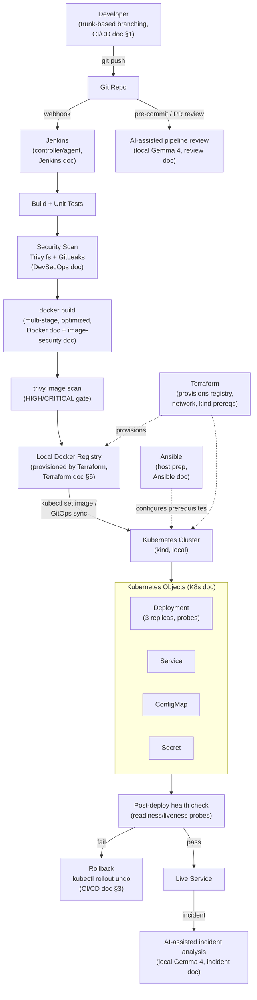
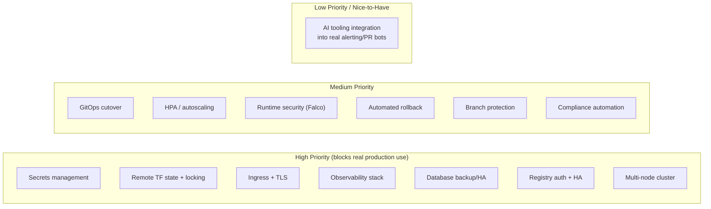
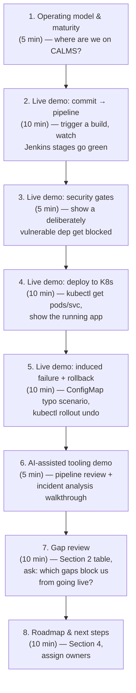
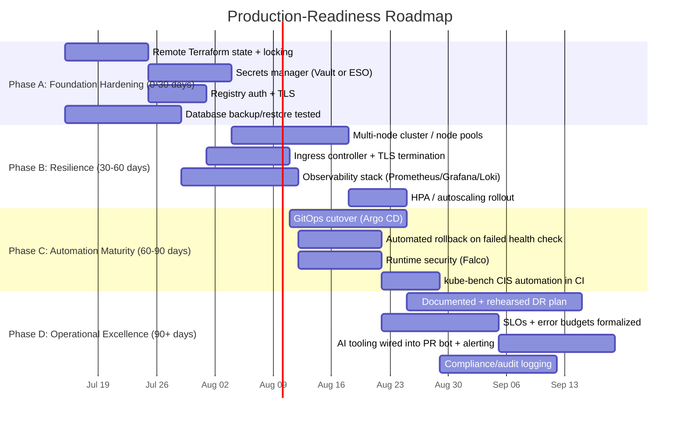

# Architecture Review & Closure

---

## 1. What Was Built — Full Architecture Recap

Across this training track, OrderFlow-Lite (a single-service Node.js/Express app with a MySQL backend and an internal background worker) moved from source code to a running, observable, security-gated Kubernetes deployment. Every arrow below is a concept covered in a companion doc.

**What this demonstrates, mapped to the CALMS maturity dimensions (main guide, Section 3):** automated build-to-deploy pipeline (Automation), small trunk-based changes with fast feedback (Lean), Trivy/GitLeaks/health-check gates producing real pass/fail data (Measurement), reusable Terraform/Ansible/Jenkinsfile configuration checked into Git (Sharing), and a rehearsed, blameless failure scenario with AI-assisted incident triage (Culture).

---

## 2. Production-Readiness Gaps

Everything above works — and is deliberately scoped for a **training lab**: single-service, single-node, local registry, no cloud spend. Treating it as production-ready without addressing the following would be a mistake. This is the honest gap list, organized by the same layers as Section 1.

| Area | Current state (this training) | Production gap | Risk if unaddressed | Priority |
|---|---|---|---|---|
| **Source control / branching** | Trunk-based, short-lived branches (CI/CD doc §1) | No branch protection rules, required reviewers, or signed commits enforced | Unreviewed changes reach `main` | Medium |
| **CI/CD pipeline** | Single Jenkins controller, builds run on "built-in node" or one agent | No Jenkins HA/backup, no agent pool for parallel builds, no pipeline-as-library reuse across projects | Single point of failure; pipeline changes not centrally governed | High |
| **Container registry** | Single local `registry:2` container, no auth, HTTP not HTTPS | No authentication, no TLS, no image retention/GC policy, no HA | Anyone on the network can push/pull; unbounded disk growth; registry outage blocks all deploys | High |
| **Image security** | Trivy HIGH/CRITICAL gate in pipeline (image-security doc) | No image signing/verification (cosign), no admission-time enforcement that only scanned images can run | A manually-pushed unscanned image can still be deployed directly via `kubectl` | Medium |
| **Secrets management** | Kubernetes Secrets, base64-encoded (K8s doc §6) | No external secrets manager (Vault, External Secrets Operator), no automatic rotation, no encryption-at-rest verification on etcd | Base64 is not encryption; secrets recoverable by anyone with cluster read access | High |
| **Infrastructure state** | Terraform with local `terraform.tfstate` (Terraform doc §7) | No remote backend with locking (S3+DynamoDB, Terraform Cloud) | Concurrent applies can corrupt state; state file (which may contain sensitive values) isn't backed up | High |
| **Deployment mechanism** | Push-based (`kubectl set image` from Jenkins) | No GitOps agent (Argo CD/Flux) reconciling desired state, despite it being documented (CI/CD doc §4) | Cluster can drift from Git without detection; Jenkins holds direct cluster credentials | Medium |
| **Kubernetes cluster** | Single-node `kind` cluster, local | No multi-node/multi-AZ resilience, no cluster autoscaler, no node pool separation | Any node failure is a full outage; no capacity headroom | High (for real prod) |
| **Networking / ingress** | `NodePort` Service, HTTP only | No Ingress controller, no TLS termination, no WAF/rate limiting | No HTTPS, no path-based routing for multiple services, exposed on arbitrary node ports | High |
| **Autoscaling** | Fixed `replicas: 3` | No Horizontal Pod Autoscaler, no resource-based or custom-metric scaling | Can't absorb traffic spikes; over-provisioned at idle, under-provisioned at peak | Medium |
| **Observability** | `kubectl logs`/`describe`/`get events` used manually (incident doc §3) | No centralized logging (Loki/ELK), no metrics stack (Prometheus/Grafana), no distributed tracing, no alerting rules | Incident detection depends on someone noticing; MTTR (DORA metric) stays high by design | High |
| **Runtime security** | Not implemented (mentioned in DevSecOps doc §4 as a category) | No Falco or equivalent runtime anomaly detection, no `kube-bench` CIS benchmark run against the cluster | Compromise inside a running container goes undetected | Medium |
| **Database** | Single MySQL container, no backups, no replication | No managed DB, no automated backup/restore tested, no read replica, no connection pooling at scale | Data loss on any MySQL container failure; no tested recovery path | High |
| **Rollback automation** | Manual `kubectl rollout undo`, human-triggered (CI/CD doc §3) | No automatic rollback on failed health check, no canary/blue-green in place despite being documented | MTTR depends on a human noticing and acting; no gradual rollout to limit blast radius | Medium |
| **AI-assisted tooling** | Local Gemma 4 model for pipeline review and incident triage (review + incident docs) | Not integrated into actual PR bots or alerting systems; entirely manual invocation today | Useful in the lab, but doesn't yet reduce real on-call toil until wired into the actual workflow | Low (nice-to-have, not a blocker) |
| **Compliance / audit** | None formalized | No CIS benchmark automation, no audit logging on `kubectl`/Jenkins actions, no access review cadence | Can't demonstrate compliance posture to auditors or leadership | Medium |
| **Disaster recovery** | None tested | No documented/rehearsed DR plan, no cross-region or cross-cluster failover | Unknown actual recovery time if the entire local environment is lost | High (for real prod) |

---

## 3. Team Walkthrough

A suggested structure for presenting this architecture to a team, stakeholders, or as a training capstone demo — sequenced so each layer builds on the one before it, mirroring how the training itself was structured.

**Suggested audience prompts for Section 7 (gap review) discussion:**
- Which High-priority gaps genuinely block a first production deployment, versus which ones are "should fix soon but not blocking"?
- Who owns each gap — is it a platform/DevOps team item, an app team item, or does it need a decision from leadership (e.g., budget for a managed database)?
- Does the team's current CALMS self-assessment (main guide, Section 3.6) match what this walkthrough revealed, or did the gap review surface weaknesses in a dimension the team thought was stronger?

**RACI sketch for closing the gaps** (fill in real names before using):

| Gap category | Responsible | Accountable | Consulted | Informed |
|---|---|---|---|---|
| Secrets management, TLS, registry auth | Platform/DevOps | Eng lead | Security | Whole eng team |
| Observability stack | Platform/DevOps | Eng lead | SRE/on-call | Whole eng team |
| Database HA/backup | Platform/DevOps or DBA | Eng lead | App team | Whole eng team |
| GitOps cutover, autoscaling | Platform/DevOps | Eng lead | App team | Whole eng team |
| Compliance automation | Security | Eng lead | Platform/DevOps | Leadership |

---

## 4. Next-Step Roadmap

Phased to close the High-priority gaps first, building directly on the adoption roadmap already defined in the main operating model guide (Section 5) — this is that roadmap's Phase 4 ("Optimize") made concrete for this specific architecture.

| Phase | Timeframe | Focus | Closes these Section 2 gaps |
|---|---|---|---|
| **A — Foundation Hardening** | 0–30 days | Make the existing single-node setup safe to depend on | Remote TF state, secrets management, registry auth/TLS, DB backup |
| **B — Resilience** | 30–60 days | Remove single points of failure | Multi-node cluster, ingress/TLS, observability, autoscaling |
| **C — Automation Maturity** | 60–90 days | Reduce manual intervention, close the loop on security | GitOps cutover, automated rollback, runtime security, CIS automation |
| **D — Operational Excellence** | 90+ days | Prove it under real failure conditions, formalize targets | DR rehearsal, SLOs/error budgets, AI tooling integration, compliance |

**Exit criteria for calling this "production-ready"** — the roadmap is done when every High-priority row in Section 2's table has a checked-off Phase A/B item, a DR plan has been rehearsed at least once (Phase D), and the team's DORA metrics (main guide, Section 4) are being tracked automatically rather than manually — at that point, re-run the CALMS self-assessment (main guide, Section 3.6) and confirm the score has actually moved, not just the infrastructure.

---

## 5. Closing Summary

This training track built a complete, working DevOps pipeline end to end — operating model and maturity framing, branching/quality-gates/rollback, Docker and image security, Kubernetes deployment with Deployments/Services/ConfigMaps/Secrets, Jenkins automation, Terraform/Ansible infrastructure provisioning, DevSecOps scanning, and AI-assisted review/incident tooling — all runnable locally, all documented, all reusable as a reference. The gap list in Section 2 isn't a criticism of that work; it's the explicit, honest boundary between "a training lab that teaches the concepts correctly" and "a system trusted with real customer traffic and data." Closing that gap is the next project, not a flaw in this one.

---

