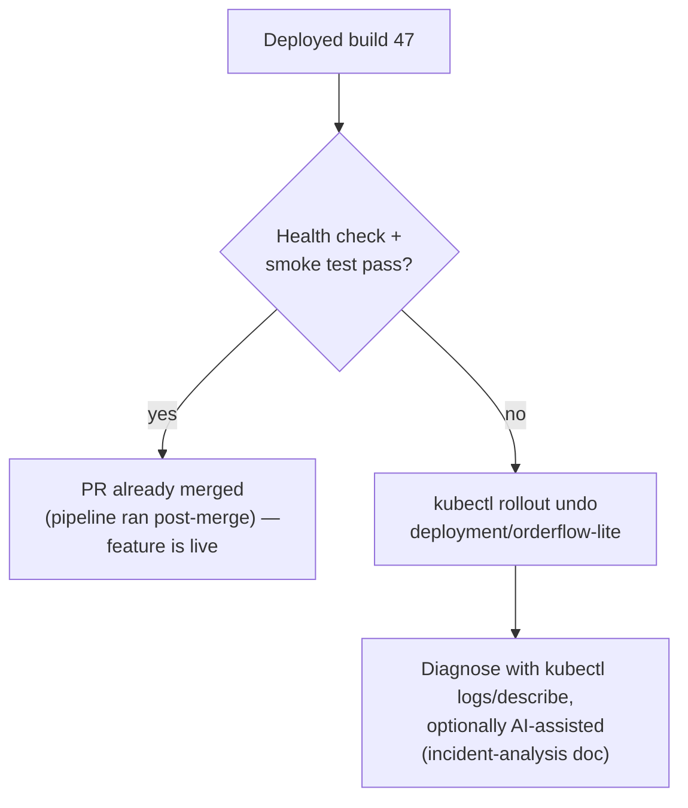

# Capstone Case Study: Ship the "Cancel Order" Feature End to End


**The feature:** add a `POST /orders/:id/cancel` endpoint to OrderFlow-Lite, so a `pending` order can be moved to a new `cancelled` state (extending the existing `pending → completed/failed` state machine), with an audit trail entry recorded — the same `feature/order-cancel` branch used as the illustrative example in the CI/CD companion doc's branching diagram.

---

## 0. The End-to-End Picture

```mermaid
flowchart LR
    T1["1. Branch"] --> T2["2. Code the feature"]
    T2 --> T3["3. Write/update tests"]
    T3 --> T4["4. Commit + push"]
    T4 --> T5["5. Jenkins: build + test"]
    T5 --> T6["6. Jenkins: security scan\nGitLeaks + Trivy"]
    T6 --> T7["7. Docker build + image scan"]
    T7 --> T8["8. Push to registry"]
    T8 --> T9["9. Deploy to Kubernetes"]
    T9 --> T10["10. Verify + merge"]
```



| Step | Tool | Companion doc |
|---|---|---|
| 1, 4, 10 | Git | CI/CD workflow doc, §1 |
| 2, 3 | Node.js / Jest | — (app code) |
| 5, 6 | Jenkins | Jenkins doc |
| 6 | GitLeaks, Trivy | DevSecOps doc |
| 7, 8 | Docker, local registry | Docker doc |
| 9 | kubectl | Kubernetes doc |
| 9, 10 | Rollback if needed | CI/CD workflow doc, §3 |

---

## 1. Create the Feature Branch

```bash
git checkout main
git pull origin main
git checkout -b feature/order-cancel
```

Short-lived, trunk-based — this branch should live hours, not weeks (CI/CD companion doc, Section 1).

---

## 2. Make the Code Change

Add the cancel route and service logic. This is a small, self-contained diff — exactly the "small batch" size that keeps change failure rate low (main guide, Section 4.3).

```javascript
// src/routes/orders.js
router.post('/orders/:id/cancel', async (req, res) => {
  const order = await orderService.getById(req.params.id);

  if (!order) {
    return res.status(404).json({ error: 'Order not found' });
  }
  if (order.status !== 'pending') {
    return res.status(409).json({
      error: `Cannot cancel order in '${order.status}' status`,
    });
  }

  await orderService.cancel(order.id);
  res.status(200).json({ id: order.id, status: 'cancelled' });
});
```

```javascript
// src/services/orderService.js
async function cancel(orderId) {
  await db.query(
    'UPDATE orders SET status = ? WHERE id = ?',
    ['cancelled', orderId]
  );
  await db.query(
    'INSERT INTO order_audit (order_id, event, created_at) VALUES (?, ?, NOW())',
    [orderId, 'cancelled']
  );
}

module.exports = { ...existingExports, cancel };
```

---

## 3. Write the Test

```javascript
// tests/orders.cancel.test.js
const request = require('supertest');
const app = require('../src/app');
const db = require('../src/db');

describe('POST /orders/:id/cancel', () => {
  test('cancels a pending order', async () => {
    const order = await db.seedOrder({ status: 'pending' });

    const res = await request(app).post(`/orders/${order.id}/cancel`);

    expect(res.status).toBe(200);
    expect(res.body.status).toBe('cancelled');
  });

  test('rejects cancelling a completed order', async () => {
    const order = await db.seedOrder({ status: 'completed' });

    const res = await request(app).post(`/orders/${order.id}/cancel`);

    expect(res.status).toBe(409);
  });

  test('returns 404 for a nonexistent order', async () => {
    const res = await request(app).post('/orders/does-not-exist/cancel');

    expect(res.status).toBe(404);
  });
});
```

```bash
# Run locally before pushing — catch failures before the pipeline does
npm test -- orders.cancel.test.js
```

---

## 4. Commit and Push

```bash
git add src/routes/orders.js src/services/orderService.js tests/orders.cancel.test.js
git commit -m "Add POST /orders/:id/cancel endpoint with audit trail"
git push -u origin feature/order-cancel
```

Open a pull request into `main`. The webhook configured in the Jenkins companion doc (Section 5.2) fires immediately.

---

## 5. Jenkins: Build & Test

The Jenkinsfile from the Jenkins companion doc (Section 5.3) runs automatically:

```groovy
stage('Checkout') {
    steps { checkout scm }
}

stage('Build') {
    steps {
        sh 'npm ci'
        sh 'npm run build'
    }
}

stage('Unit Tests') {
    steps {
        sh 'npm test -- --coverage'
    }
    post {
        always { junit 'reports/junit.xml' }
    }
}
```

Watch the Stage View: `Checkout` and `Build` go green quickly; `Unit Tests` runs the new `orders.cancel.test.js` alongside the existing suite. If a test fails here, the pipeline stops — nothing downstream (Docker, Kubernetes) ever runs, which is the point of gate ordering (CI/CD companion doc, Section 2).

---

## 6. Jenkins: Security Scan

```groovy
stage('Security Scan') {
    steps {
        sh 'gitleaks detect --source . --exit-code 1'
        sh 'trivy fs --severity HIGH,CRITICAL --exit-code 1 .'
    }
}
```

For this feature, the new code introduces no new dependencies and no secrets — this stage should pass cleanly (DevSecOps companion doc, Sections 2–3). If a teammate had, say, hardcoded a test API key in `orderService.js` by mistake, GitLeaks catches it right here, before it's baked into an image.

---

## 7 & 8. Docker Build, Image Scan, Push

```groovy
stage('Docker Build & Push') {
    steps {
        sh "docker build -t ${REGISTRY}/${IMAGE_NAME}:${IMAGE_TAG} ."
        sh "trivy image --severity HIGH,CRITICAL --exit-code 1 ${REGISTRY}/${IMAGE_NAME}:${IMAGE_TAG}"
        sh "docker push ${REGISTRY}/${IMAGE_NAME}:${IMAGE_TAG}"
    }
}
```

`IMAGE_TAG` is `${env.BUILD_NUMBER}` — this build might land as `localhost:5000/orderflow-lite:47`. The multi-stage Dockerfile (Docker companion doc, Section 2.2) means the new route and test files don't bloat the final runtime image; only compiled output ships.

---

## 9. Deploy to Kubernetes

```groovy
stage('Approval') {
    when { branch 'main' }
    steps {
        input message: "Deploy build ${IMAGE_TAG} to production?", ok: 'Deploy'
    }
}

stage('Deploy to Kubernetes') {
    when { branch 'main' }
    steps {
        withCredentials([file(credentialsId: 'kubeconfig-cred', variable: 'KUBECONFIG')]) {
            sh """
                kubectl set image deployment/orderflow-lite \
                  orderflow=${REGISTRY}/${IMAGE_NAME}:${IMAGE_TAG}
                kubectl rollout status deployment/orderflow-lite --timeout=120s
            """
        }
    }
}
```

This only runs once the PR is merged to `main` (`when { branch 'main' }`) — during PR review, the pipeline runs Steps 5–8 to prove the change is safe, but doesn't touch the cluster.

---

## 10. Verify, and Merge (or Roll Back)

```bash
# Confirm the new pods are running the new image
kubectl get pods -l app=orderflow-lite -o jsonpath='{.items[*].spec.containers[*].image}'

# Smoke-test the new endpoint against the live Service
curl -X POST http://localhost:30080/orders/<some-pending-order-id>/cancel
```



If the smoke test fails — say, the audit trail insert has a typo in the column name — this is exactly the CI/CD companion doc's rollback playbook (Section 3): `kubectl rollout undo deployment/orderflow-lite` restores the previous working revision in under a minute, and the fix goes back through Steps 1–9 as a new small commit rather than a panicked hotfix.

---

## Lab Checklist

| # | Task | Done? |
|---|---|---|
| 1 | `feature/order-cancel` branched from `main` | ☐ |
| 2 | Route + service code added | ☐ |
| 3 | Unit tests added and passing locally | ☐ |
| 4 | Committed, pushed, PR opened | ☐ |
| 5 | Jenkins build + unit test stages green | ☐ |
| 6 | GitLeaks and Trivy `fs` scans clean | ☐ |
| 7 | Docker image built and `trivy image` scan clean | ☐ |
| 8 | Image pushed to local registry with build-numbered tag | ☐ |
| 9 | Deployed via `kubectl set image`, rollout healthy | ☐ |
| 10 | Endpoint smoke-tested against the live Service, PR merged | ☐ |

---

## What This Demonstrated

One feature, one pass through the whole pipeline, touching every layer covered in this training: trunk-based branching and small-batch changes (Lean), an automated build/test/scan/deploy chain (Automation), Trivy and GitLeaks catching issues before they ship (Measurement + shift-left security), and a rollback path ready if the health check had failed (Culture — no panic, just `rollout undo` and try again). This is the loop every real feature goes through — the capstone just makes it visible, once, end to end.

---


