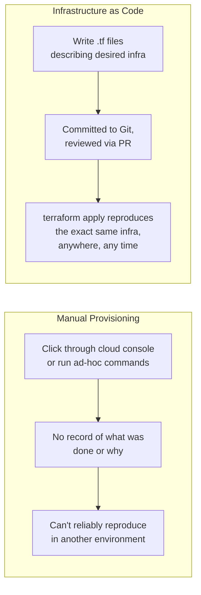
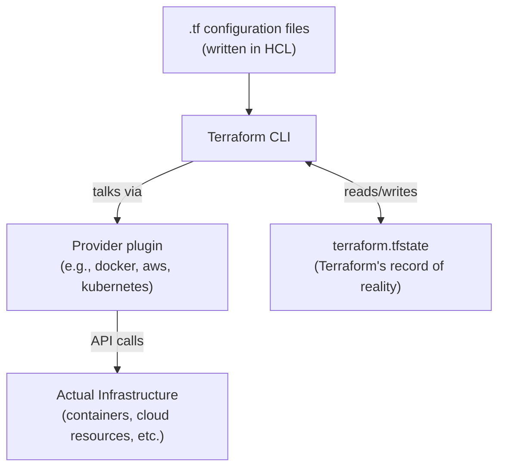
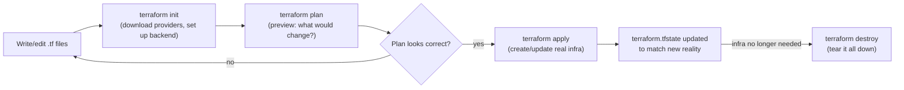
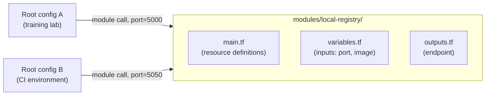

# Infrastructure as Code & Terraform Basics


---

## 1. What Infrastructure as Code Solves

Without IaC, infrastructure is created by someone clicking through a console or running one-off shell commands — undocumented, unrepeatable, and impossible to diff or review. IaC describes infrastructure in text files, checked into version control like application code, so provisioning becomes repeatable, reviewable, and auditable — the same "Lean" and "Sharing" principles from the CALMS framework (main operating model guide, Section 3) applied to infrastructure instead of app code.



Terraform (by HashiCorp) is the most widely used general-purpose IaC tool — it's **declarative** (you describe the end state you want, not the steps to get there) and **provider-agnostic** (the same workflow provisions AWS, Kubernetes, Docker, or hundreds of other targets).

---

## 2. Core Concepts

| Concept | What it is |
|---|---|
| **HCL** | HashiCorp Configuration Language — the `.tf` file syntax Terraform configuration is written in |
| **Provider** | A plugin that lets Terraform talk to a specific platform (AWS, Kubernetes, Docker, etc.) — translates HCL into that platform's API calls |
| **Resource** | A single infrastructure object Terraform manages (a container, a VPC, a Kubernetes namespace) |
| **State** | Terraform's record of what it last created, stored in a `terraform.tfstate` file — how it knows the difference between "desired" and "already exists" |
| **Variable** | A named input that parameterizes a configuration (Section 5) |
| **Output** | A named value Terraform exposes after `apply` (e.g., a container's IP, a generated ID) |
| **Module** | A reusable, self-contained bundle of `.tf` files that can be called with different inputs (Section 5.3) |



---

## 3. The Terraform Workflow

Four commands cover almost everything: `init`, `plan`, `apply`, `destroy`.



| Command | What it does |
|---|---|
| `terraform init` | Downloads the providers referenced in your config, sets up the backend (where state is stored). Run once per project, and again whenever providers/backends change. |
| `terraform plan` | Compares your `.tf` files against the current state and shows exactly what would be created, changed, or destroyed — **without touching anything**. This is the review step, like a `git diff` for infrastructure. |
| `terraform apply` | Executes the plan — actually creates/updates the infrastructure, then updates `terraform.tfstate` to match. |
| `terraform destroy` | Removes everything Terraform created in this configuration. Essential for a training lab so nothing lingers between sessions. |
| `terraform fmt` | Auto-formats `.tf` files to canonical style. |
| `terraform validate` | Checks syntax and internal consistency without needing provider credentials. |

**Why `plan` before `apply` matters:** it's the same "preview before you commit" principle as a pull-request diff (CI/CD companion doc, Section 1) or a `kubectl apply --dry-run` (Kubernetes companion doc). Never `apply` blind, especially against shared or production infrastructure.

---

## 4. Providers

A provider is what makes Terraform's core generic engine actually *do* something on a specific platform. You declare which providers you need and (ideally) pin their version, so a config doesn't silently pick up breaking changes months later — the same reasoning as pinning a Docker base image tag (Docker companion doc, Section 2.1).

```hcl
terraform {
  required_providers {
    docker = {
      source  = "kreuzwerker/docker"
      version = "~> 3.0"
    }
  }
}

provider "docker" {
  # Uses the local Docker daemon by default — same one used throughout
  # the Docker companion doc's docker build/run commands.
}
```

Other providers you'd meet in a broader DevOps context: `hashicorp/aws`, `hashicorp/google`, `hashicorp/azurerm` for cloud platforms, and `hashicorp/kubernetes` for managing Kubernetes objects (Deployments, Services, ConfigMaps — an alternative to the raw `kubectl apply -f` approach in the Kubernetes companion doc, useful when those objects need to be provisioned alongside cloud infrastructure in one workflow).

---

## 5. Variables and Reusable Configuration

### 5.1 Input Variables

Variables let the same configuration be reused with different values instead of hardcoding — the infra equivalent of a function parameter.

```hcl
# variables.tf
variable "registry_port" {
  description = "Host port to expose the local Docker registry on"
  type        = number
  default     = 5000
}

variable "registry_image" {
  description = "Image to use for the local registry"
  type        = string
  default     = "registry:2"
}
```

```hcl
# terraform.tfvars — override defaults per environment without editing variables.tf
registry_port = 5000
```

```bash
# Or override at the command line
terraform apply -var="registry_port=5050"
```

### 5.2 Outputs

```hcl
# outputs.tf
output "registry_endpoint" {
  description = "Address of the local Docker registry"
  value       = "localhost:${var.registry_port}"
}
```

```bash
terraform output registry_endpoint
```

### 5.3 Modules — Reusable, Shareable Configuration

A module is a directory of `.tf` files that can be called multiple times with different inputs — the same "don't repeat yourself" instinct behind reusable CI pipeline templates or Helm charts. Instead of copy-pasting the registry setup for every project, wrap it once and call it wherever needed.



```hcl
# modules/local-registry/main.tf
resource "docker_image" "registry" {
  name = var.registry_image
}

resource "docker_container" "registry" {
  name  = "local-registry"
  image = docker_image.registry.image_id

  ports {
    internal = 5000
    external = var.registry_port
  }

  volumes {
    volume_name    = "registry-data"
    container_path = "/var/lib/registry"
  }
}
```

```hcl
# Root main.tf — calling the module
module "training_registry" {
  source        = "./modules/local-registry"
  registry_port = 5000
}

output "registry_url" {
  value = module.training_registry.registry_endpoint
}
```

---

## 6. Simple Worked Example: Local Docker Network + Registry

This provisions the exact same local registry setup covered manually in the Docker companion doc (Section 5) — but declaratively, so it's reproducible and reviewable. No cloud account or credentials needed, which makes it a safe first Terraform exercise.

**Project layout:**

```
terraform-local-registry/
├── main.tf
├── variables.tf
├── outputs.tf
└── terraform.tfvars
```

```hcl
# main.tf
terraform {
  required_providers {
    docker = {
      source  = "kreuzwerker/docker"
      version = "~> 3.0"
    }
  }
}

provider "docker" {}

resource "docker_network" "lab_net" {
  name = "terraform-lab-net"
}

resource "docker_volume" "registry_data" {
  name = "terraform-registry-data"
}

resource "docker_image" "registry" {
  name = var.registry_image
}

resource "docker_container" "registry" {
  name    = "local-registry"
  image   = docker_image.registry.image_id
  restart = "always"

  networks_advanced {
    name = docker_network.lab_net.name
  }

  ports {
    internal = 5000
    external = var.registry_port
  }

  volumes {
    volume_name    = docker_volume.registry_data.name
    container_path = "/var/lib/registry"
  }
}
```

```hcl
# variables.tf
variable "registry_image" {
  description = "Registry image to run"
  type        = string
  default     = "registry:2"
}

variable "registry_port" {
  description = "Host port for the registry"
  type        = number
  default     = 5000
}
```

```hcl
# outputs.tf
output "registry_endpoint" {
  description = "Local registry address"
  value       = "localhost:${var.registry_port}"
}

output "network_name" {
  value = docker_network.lab_net.name
}
```

```hcl
# terraform.tfvars
registry_port = 5000
```

**Run it:**

```bash
cd terraform-local-registry

# Download the docker provider
terraform init

# Preview what will be created
terraform plan

# Create it
terraform apply
# Terraform will show the plan again and prompt: "Enter a value:" — type 'yes'

# Confirm it worked, same verification as the manual setup in the Docker companion doc
curl http://localhost:5000/v2/_catalog

# See the outputs
terraform output registry_endpoint

# Tear it down when done with the lab
terraform destroy
```

**Expected `terraform plan` output (abridged):**

```
Terraform will perform the following actions:

  # docker_network.lab_net will be created
  + resource "docker_network" "lab_net" { ... }

  # docker_volume.registry_data will be created
  + resource "docker_volume" "registry_data" { ... }

  # docker_image.registry will be created
  + resource "docker_image" "registry" { ... }

  # docker_container.registry will be created
  + resource "docker_container" "registry" { ... }

Plan: 4 to add, 0 to change, 0 to destroy.
```

This is the same registry that the Docker, Kubernetes, and Jenkins companion docs all reference at `localhost:5000` — once applied, `docker tag`/`docker push` and the `kind` containerd-mirror setup from the Docker companion doc (Section 5.5) work exactly as before, just provisioned by Terraform instead of a raw `docker run`.

---

## 7. State Management (Brief)

By default, state lives in a local `terraform.tfstate` file — fine for a single person or a training lab, risky for a team (two people applying at once can corrupt or overwrite each other's changes). For team use, state is typically moved to a **remote backend** (e.g., an S3 bucket with DynamoDB locking, or Terraform Cloud) so state is shared and locked during `apply`. This is a "when you scale past solo/local use" concern — not needed for the exercise in Section 6, but worth knowing the term for when a real project's Terraform grows beyond one laptop.

---

## 8. How This Fits the Bigger Picture

- **Docker companion doc, Section 5**: the worked example here (Section 6) is a declarative rewrite of that section's manual `docker run` registry setup — same result, reproducible via `terraform apply` instead of remembered shell history.
- **CI/CD companion doc, Section 1 (Branching)**: `.tf` files live in Git and go through the same PR review as application code — a `terraform plan` output posted on a pull request is the infrastructure equivalent of a CI test result.
- **GitOps (CI/CD companion doc, Section 4)**: Terraform provisions the underlying infrastructure (clusters, networks, registries); GitOps tools like Argo CD then manage what runs *inside* that already-provisioned Kubernetes cluster — the two are complementary layers, not competitors.
- **Main operating model guide, Adoption Roadmap (Section 5)**: Terraform is one of the concrete "Foundation" and "Automate the Pipeline" phase tools — turning ad-hoc environment setup into version-controlled, repeatable configuration is exactly the Lean/Automation maturity jump CALMS describes.

---

